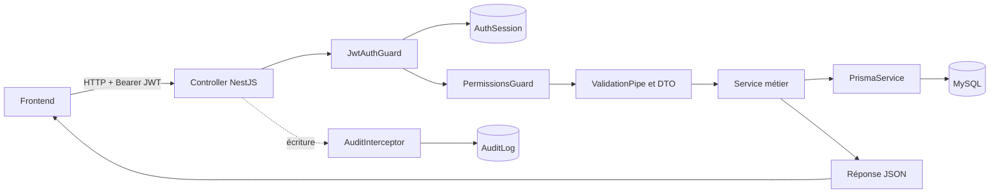
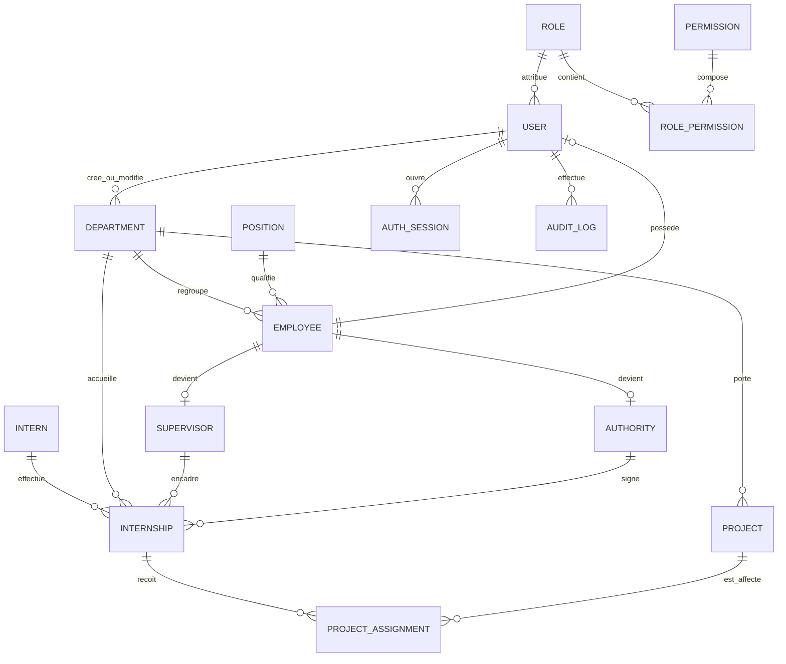

# Conception du backend actuel — Gestion des stagiaires

| Information | Valeur |
|---|---|
| Projet | Gestion des stagiaires |
| Application | Backend NestJS de l'entreprise |
| Nature du document | Conception de l'existant (« as-is ») |
| Version du document | 0.1 |
| Date de référence | 27 août 2026 |
| Base de données | MySQL 8.0.40 Commercial |
| ORM | Prisma 7.9.1 |
| Branche observée | `codex/intern-module` |
| Commit de référence | `8113f9c` |

## 1. Objet du document

Ce document présente la conception du backend actuellement implémenté dans le
dépôt `gestion_stagiaire_entreprise`. Son objectif est de permettre à un
développeur, un responsable métier ou un membre de l'équipe frontend de
comprendre :

- les responsabilités du backend ;
- les domaines fonctionnels ;
- la différence entre les notions proches ;
- la structure de la base de données ;
- le parcours d'une requête ;
- les routes exposées ;
- l'authentification et les autorisations ;
- les règles métier déjà appliquées ;
- la gestion des sessions et du journal d'audit ;
- les migrations et les contrôles nécessaires avant un déploiement.

Ce document ne décrit pas le futur backend simplifié préparé dans un autre
dossier. Le backend actuel conserve notamment `Employee`, `Position`, `Role`,
`Permission`, `AuthSession` et `ProjectAssignment`.

## 2. Périmètre fonctionnel actuel

Le backend gère les fonctionnalités suivantes :

1. connexion et gestion des sessions ;
2. changement obligatoire du mot de passe initial ;
3. gestion des utilisateurs ;
4. gestion des rôles et permissions ;
5. gestion des départements et postes ;
6. gestion des employés ;
7. gestion des stagiaires ;
8. gestion des maîtres de stage ;
9. gestion des autorités signataires ;
10. gestion des stages ;
11. gestion des projets ;
12. affectation des projets aux stages ;
13. tableau de bord ;
14. journal d'audit ;
15. vérification de la connexion à MySQL ;
16. documentation interactive Swagger/OpenAPI.

## 3. Technologies et dépendances structurantes

| Technologie | Rôle dans le projet |
|---|---|
| NestJS 11 | Framework HTTP et organisation modulaire |
| TypeScript | Langage du backend |
| Prisma 7 | Modélisation et accès à MySQL |
| Adaptateur MariaDB | Connexion technique de Prisma au serveur compatible MySQL |
| MySQL 8.0.40 Commercial | Base de données de l'entreprise |
| Argon2id | Hachage des mots de passe |
| JWT | Jetons d'accès courts |
| class-validator | Validation des données reçues |
| class-transformer | Transformation des paramètres et DTO |
| Swagger/OpenAPI | Contrat et test interactif des API |
| Jest | Tests unitaires |

L'utilisation de l'adaptateur MariaDB dans le code ne signifie pas que la base
est PostgreSQL. Le fournisseur Prisma déclaré dans `schema.prisma` est bien
`mysql`.

## 4. Architecture générale

### 4.1 Chemin d'une requête métier protégée



### 4.2 Responsabilités des fichiers

Une ressource métier suit généralement cette organisation :

```text
src/department/
├── dto/
│   ├── create-department.dto.ts
│   └── update-department.dto.ts
├── entities/
│   └── department.entity.ts
├── department.controller.ts
├── department.module.ts
└── department.service.ts
```

| Élément | Responsabilité |
|---|---|
| `controller` | Déclare les routes et transmet la requête au service |
| `service` | Applique les règles métier et utilise Prisma |
| `dto` | Déclare et valide les données acceptées |
| `entity` | Décrit une représentation TypeScript/Swagger de la ressource |
| `module` | Assemble le contrôleur, le service et ses dépendances |
| `guard` | Autorise ou refuse l'accès à une route |
| `interceptor` | Exécute un traitement transversal, notamment l'audit |
| `spec` | Vérifie le comportement avec Jest |

### 4.3 Configuration HTTP globale

Le démarrage de l'application applique :

- une validation globale des DTO ;
- la suppression des champs non déclarés (`whitelist`) ;
- le refus explicite des champs inconnus (`forbidNonWhitelisted`) ;
- la transformation automatique des valeurs compatibles ;
- une liste CORS configurable par `FRONTEND_ORIGINS` ;
- l'écoute sur toutes les interfaces réseau (`0.0.0.0`) ;
- le port `3000` par défaut.

Il n'existe actuellement aucun préfixe global `/api`. Une route déclarée
`@Controller('departments')` est donc accessible avec `/departments`.

Swagger est disponible à :

```text
GET /api/docs
GET /api/docs-json
```

## 5. Modules actifs

| Module | Responsabilité principale |
|---|---|
| `PrismaModule` | Connexion à MySQL et accès aux tables |
| `HealthModule` | Test de disponibilité de la base |
| `AuthModule` | Connexion, renouvellement, déconnexion et mot de passe |
| `RoleModule` | Administration des rôles |
| `PermissionModule` | Consultation du catalogue des permissions |
| `UserModule` | Administration des comptes utilisateurs |
| `DepartmentModule` | Référentiel des départements |
| `PositionModule` | Référentiel des postes |
| `EmployeeModule` | Personnel interne de l'entreprise |
| `InternModule` | Identité et parcours scolaire des stagiaires |
| `SupervisorModule` | Maîtres de stage issus des employés |
| `AuthorityModule` | Autorités signataires issues des employés |
| `InternshipModule` | Périodes de stage et suivi |
| `ProjectModule` | Projets de l'entreprise |
| `ProjectAssignmentModule` | Liaison entre projets et stages |
| `DashboardModule` | Indicateurs et activités récentes |
| `AuditModule` | Enregistrement et consultation de l'audit |

## 6. Vocabulaire métier et distinctions importantes

### 6.1 Employé et utilisateur

Un `Employee` représente une personne membre du personnel. Il contient son
matricule, son identité, son email professionnel, son département et son poste.

Un `User` représente le compte qui permet à cette personne de se connecter. Le
compte contient les éléments de sécurité : mot de passe haché, rôle, statut,
obligation de changer le mot de passe et sessions.

Conséquences :

- un employé peut exister sans compte utilisateur ;
- un utilisateur doit obligatoirement être lié à un employé ;
- un seul compte peut être créé pour un employé ;
- désactiver un utilisateur retire l'accès, sans supprimer l'employé.

### 6.2 Poste et rôle

Un `Position` est un poste professionnel : développeur backend, responsable RH
ou administrateur système.

Un `Role` est un ensemble d'autorisations applicatives. Le poste indique ce que
la personne fait dans l'entreprise ; le rôle indique ce qu'elle peut faire dans
l'application.

### 6.3 Employé et maître de stage

Un `Supervisor` est une spécialisation d'un employé. Tous les employés ne sont
pas maîtres de stage. Un employé ne peut avoir qu'une seule fiche de maître de
stage, tandis qu'un maître de stage peut suivre plusieurs stages.

### 6.4 Employé et autorité signataire

Une `Authority` est également liée à un employé. Elle contient en plus un nom
d'autorité, une adresse email de signature, un titre de signataire et,
éventuellement, un département.

### 6.5 Stagiaire et stage

Un `Intern` représente la personne et ses informations scolaires. Un
`Internship` représente une période précise passée dans l'entreprise. La même
personne peut donc effectuer plusieurs stages à des périodes différentes.

### 6.6 Projet et affectation de projet

Un `Project` décrit un projet avec ses dates, son statut, son département et son
lien GitLab.

Un `ProjectAssignment` relie un projet à un stage et précise le rôle du
stagiaire sur le projet, les dates de l'affectation et son statut. Dans le
backend actuel, `Internship` ne contient pas directement `projectId`.

## 7. Modèle relationnel

### 7.1 Vue d'ensemble



### 7.2 Entités de sécurité

#### `Role`

- `id` : UUID ;
- `name` : nom unique ;
- `description` : optionnelle ;
- `isActive` : activation logique ;
- dates de création et de modification.

#### `Permission`

- `id` : UUID ;
- `code` : code technique unique, par exemple `projects.create` ;
- `name`, `description`, `category` ;
- `isActive`.

#### `RolePermission`

Table d'association entre les rôles et les permissions. Sa clé primaire est le
couple `roleId + permissionId`.

#### `User`

- relation obligatoire vers `Employee` ;
- relation obligatoire vers `Role` ;
- mot de passe haché ;
- indicateur `mustChangePassword` ;
- date du dernier changement de mot de passe ;
- date de dernière connexion ;
- activation logique.

#### `AuthSession`

- relation vers l'utilisateur ;
- empreinte unique du refresh token ;
- date d'expiration ;
- date de dernière utilisation ;
- date de révocation ;
- adresse IP et navigateur/appareil ;
- dates techniques.

### 7.3 Référentiels organisationnels

#### `Department`

- nom et code uniques ;
- description ;
- activation logique ;
- utilisateurs ayant créé ou modifié la fiche ;
- relations vers employés, autorités, stages et projets.

#### `Position`

- code et nom uniques ;
- description ;
- activation logique ;
- relation vers les employés.

#### `Employee`

- matricule unique ;
- prénom, nom et email unique ;
- téléphone optionnel ;
- poste et département obligatoires ;
- activation logique ;
- compte utilisateur, fiche encadreur et fiche autorité optionnels.

### 7.4 Gestion des stages

#### `Intern`

- code d'inscription unique généré par le backend ;
- identité et date de naissance ;
- genre ;
- email unique, téléphone et adresse ;
- école, filière, niveau et année d'étude ;
- contact d'urgence optionnel ;
- activation logique.

#### `Internship`

- référence unique générée par le backend ;
- titre et description ;
- dates de début et de fin ;
- statut et type ;
- indemnité, devise et lieu de travail ;
- stagiaire, département et maître de stage obligatoires ;
- autorité optionnelle ;
- note optionnelle entre 0 et 20 ;
- activation logique.

#### `Project`

- code unique généré par le backend ;
- nom et description ;
- lien GitLab optionnel ;
- dates de début et de fin ;
- statut ;
- département obligatoire ;
- activation logique.

#### `ProjectAssignment`

- stage et projet obligatoires ;
- rôle du stagiaire dans le projet ;
- date d'affectation automatique ;
- dates de début et de fin de l'affectation ;
- statut et notes ;
- unicité du couple `internshipId + projectId`.

### 7.5 Journal d'audit

`AuditLog` conserve :

- l'utilisateur, lorsqu'il est identifiable ;
- l'action et son résultat ;
- la ressource et son identifiant ;
- un libellé humain de l'entité ;
- la méthode et le chemin HTTP ;
- le code de statut ;
- l'adresse IP et le navigateur ;
- des métadonnées JSON nettoyées ;
- la date de l'événement.

### 7.6 Séquences de codes

Trois tables techniques réservent le prochain numéro annuel :

- `InternRegistrationCodeSequence` ;
- `InternshipReferenceCodeSequence` ;
- `ProjectCodeSequence`.

Elles empêchent de déterminer le prochain numéro par un simple comptage, ce qui
serait fragile en présence de créations simultanées.

## 8. Énumérations métier

| Énumération | Valeurs |
|---|---|
| `Gender` | `MALE`, `FEMALE` |
| `EducationLevel` | `LICENCE`, `MASTER` |
| `InternshipType` | `ACADEMIC`, `PROFESSIONAL` |
| `InternshipStatus` | `PLANNED`, `ONGOING`, `COMPLETED`, `CANCELLED` |
| `ProjectStatus` | `PLANNED`, `ONGOING`, `COMPLETED`, `CANCELLED`, `ON_HOLD` |
| `AssignmentStatus` | `ASSIGNED`, `IN_PROGRESS`, `COMPLETED`, `REMOVED` |
| `AuditAction` | `CREATE`, `UPDATE`, `DELETE`, `LOGIN`, `LOGOUT`, `PASSWORD_CHANGE`, `PASSWORD_RESET` |
| `AuditOutcome` | `SUCCESS`, `FAILURE` |

## 9. Authentification et sessions

### 9.1 Connexion

`POST /auth/login` reçoit l'email professionnel et le mot de passe. Le service :

1. recherche le compte par l'email de l'employé ;
2. vérifie l'activation de l'employé, du compte et du rôle ;
3. vérifie le mot de passe avec Argon2 ;
4. crée une ligne `AuthSession` ;
5. génère un JWT d'accès contenant notamment l'utilisateur et la session ;
6. génère un refresh token aléatoire ;
7. conserve seulement son empreinte dans la base ;
8. transmet le refresh token dans un cookie HTTP-only par défaut.

Durées par défaut :

- access token : 900 secondes, soit 15 minutes ;
- refresh token : 604 800 secondes, soit 7 jours.

### 9.2 Vérification de chaque requête

`JwtAuthGuard` ne se contente pas de vérifier la signature du JWT. Il recharge
la session dans MySQL et vérifie :

- que la session existe ;
- qu'elle appartient bien à l'utilisateur du jeton ;
- qu'elle n'est ni expirée ni révoquée ;
- que l'utilisateur, l'employé et le rôle sont actifs ;
- que le mot de passe n'a pas changé depuis l'émission du jeton.

Cette vérification permet à une déconnexion ou un changement de mot de passe
d'invalider immédiatement les anciens jetons.

### 9.3 Renouvellement

`POST /auth/refresh` valide le refresh token et effectue une rotation : l'ancien
refresh token n'est plus réutilisable et une nouvelle paire de jetons est
créée.

### 9.4 Déconnexion

`POST /auth/logout` révoque la session et supprime le cookie de refresh token.
Le JWT d'accès associé est ensuite rejeté, même si sa date cryptographique
d'expiration n'est pas encore atteinte.

### 9.5 Premier mot de passe

Un compte peut être créé avec `mustChangePassword = true`. Dans ce cas,
`JwtAuthGuard` bloque les routes métier avec le code
`PASSWORD_CHANGE_REQUIRED`. Seules les opérations explicitement autorisées,
notamment le profil et le changement de mot de passe, restent accessibles.

## 10. Autorisation par rôles et permissions

Chaque utilisateur possède un rôle. Un rôle possède plusieurs permissions via
`RolePermission`. Les contrôleurs protégés appliquent successivement :

1. `JwtAuthGuard` pour authentifier la session ;
2. `PermissionsGuard` pour comparer les permissions de l'utilisateur avec
   celles exigées par `@RequirePermissions(...)`.

Les catégories de permissions actuelles couvrent :

- tableau de bord ;
- départements ;
- postes ;
- employés ;
- utilisateurs ;
- rôles et permissions ;
- stagiaires ;
- maîtres de stage ;
- autorités ;
- stages ;
- projets ;
- affectations ;
- audit.

Le seed crée cinq rôles initiaux :

- `ADMINISTRATEUR` ;
- `UTILISATEUR` ;
- `RH` ;
- `ENCADREUR` ;
- `DIRECTION`.

Le rôle ne doit pas être confondu avec le poste professionnel.

## 11. Catalogue des routes

### 11.1 Routes publiques ou spéciales

| Méthode | Route | Fonction |
|---|---|---|
| `GET` | `/` | Réponse simple de l'application |
| `GET` | `/health/database` | Vérification de la connexion MySQL |
| `POST` | `/auth/login` | Connexion |
| `POST` | `/auth/refresh` | Renouvellement de session |
| `POST` | `/auth/logout` | Révocation par refresh token |
| `GET` | `/auth/me` | Profil de l'utilisateur connecté |
| `PATCH` | `/auth/change-password` | Changement du mot de passe courant |

`/auth/me` et `/auth/change-password` demandent un JWT, mais restent autorisés
lorsque le changement initial du mot de passe est encore obligatoire.

### 11.2 Routes métier protégées

| Domaine | Création | Liste | Détail | Modification | Désactivation/retrait |
|---|---|---|---|---|---|
| Départements | `POST /departments` | `GET /departments` | `GET /departments/:id` | `PATCH /departments/:id` | `DELETE /departments/:id` |
| Postes | `POST /positions` | `GET /positions` | `GET /positions/:id` | `PATCH /positions/:id` | `DELETE /positions/:id` |
| Employés | `POST /employees` | `GET /employees` | `GET /employees/:id` | `PATCH /employees/:id` | `DELETE /employees/:id` |
| Utilisateurs | `POST /users` | `GET /users` | `GET /users/:id` | `PATCH /users/:id` | `DELETE /users/:id` |
| Rôles | `POST /roles` | `GET /roles` | `GET /roles/:id` | `PATCH /roles/:id` | `DELETE /roles/:id` |
| Stagiaires | `POST /interns` | `GET /interns` | `GET /interns/:id` | `PATCH /interns/:id` | `DELETE /interns/:id` |
| Encadreurs | `POST /supervisors` | `GET /supervisors` | `GET /supervisors/:id` | `PATCH /supervisors/:id` | `DELETE /supervisors/:id` |
| Autorités | `POST /authorities` | `GET /authorities` | `GET /authorities/:id` | `PATCH /authorities/:id` | `DELETE /authorities/:id` |
| Stages | `POST /internships` | `GET /internships` | `GET /internships/:id` | `PATCH /internships/:id` | `DELETE /internships/:id` |
| Projets | `POST /projects` | `GET /projects` | `GET /projects/:id` | `PATCH /projects/:id` | `DELETE /projects/:id` |
| Affectations | `POST /project-assignments` | `GET /project-assignments` | `GET /project-assignments/:id` | `PATCH /project-assignments/:id` | `DELETE /project-assignments/:id` |

Routes supplémentaires :

| Méthode | Route | Permission/fonction |
|---|---|---|
| `GET` | `/dashboard` | `dashboard.read` |
| `GET` | `/internships/tracking` | `internships.read` |
| `GET` | `/permissions` | `permissions.read` |
| `GET` | `/permissions/:id` | `permissions.read` |
| `PUT` | `/roles/:id/permissions` | `roles.permissions.manage` |
| `PATCH` | `/users/:id/reset-password` | `users.reset-password` |
| `GET` | `/audit-logs` | `audit-logs.read` |
| `GET` | `/audit-logs/:id` | `audit-logs.read` |

Pour les CRUD, les permissions suivent généralement le format :

```text
ressource.read
ressource.create
ressource.update
ressource.deactivate
```

## 12. Principales données reçues à la création

| Domaine | Données principales |
|---|---|
| Département | `name`, `code`, `description?`, `isActive?` |
| Poste | `code`, `name`, `description?`, `isActive?` |
| Employé | `employeeNumber`, `firstName`, `lastName`, `email`, `phone?`, `positionId`, `departmentId`, `isActive?` |
| Utilisateur | `employeeId`, `roleId`, `password`, `confirmPassword`, `mustChangePassword?`, `isActive?` |
| Encadreur | `employeeId`, `isActive?` |
| Autorité | `employeeId`, `departmentId?`, `name`, `email`, `signingTitle`, `isActive?` |
| Stagiaire | identité, naissance, genre, email, téléphone, école, filière, niveau, année et contact d'urgence |
| Stage | titre, dates, type, indemnité, devise, lieu, `internId`, `departmentId`, `supervisorId`, `authorityId?`, note et statut |
| Projet | nom, description, lien GitLab, dates, statut, `departmentId`, activation |
| Affectation | `internshipId`, `projectId`, rôle, dates, statut et notes |

Les codes `registrationCode`, `referenceCode` et `projectCode` ne doivent pas
être saisis par le frontend : ils sont produits par le backend.

## 13. Règles métier principales

### 13.1 Référentiels

- le nom et le code d'un département sont uniques ;
- le nom et le code d'un poste sont uniques ;
- les codes sont normalisés avant enregistrement ;
- un poste encore attribué à un employé actif ne peut pas être désactivé ;
- les relations de création exigent des références existantes et actives.

### 13.2 Employés et comptes

- matricule et email d'employé uniques ;
- département et poste obligatoirement actifs ;
- un seul compte utilisateur par employé ;
- un compte doit utiliser un employé et un rôle actifs ;
- mots de passe d'administration d'au moins 15 caractères ;
- mot de passe et confirmation identiques ;
- impossible de désactiver son propre compte ;
- impossible de désactiver ou rétrograder le dernier administrateur actif ;
- une réinitialisation de mot de passe révoque les sessions existantes ;
- le nouveau mot de passe doit être différent de l'ancien.

### 13.3 Encadreurs et autorités

- l'employé correspondant doit exister et être actif ;
- un employé ne peut avoir qu'une fiche encadreur ;
- un employé ou un email d'autorité ne peut être réutilisé ;
- un encadreur associé à un stage planifié ou en cours ne peut pas être
  désactivé ;
- une autorité associée à un stage planifié ou en cours ne peut pas être
  désactivée.

### 13.4 Stagiaires

- l'email est unique et normalisé ;
- la date de naissance doit être valide et ne peut pas être future ;
- l'année d'étude est comprise entre 1 et 10 ;
- le code est généré sous la forme `STG-AAAA-NNNN` ;
- le backend vérifie l'unicité et passe au numéro suivant en cas de collision ;
- un stagiaire ayant un stage planifié ou en cours ne peut pas être désactivé.

### 13.5 Stages

- la référence est générée sous la forme `STAGE-AAAA-NNNN` ;
- la date de fin est postérieure ou égale à la date de début ;
- stagiaire, département et encadreur doivent être actifs ;
- l'autorité est optionnelle, mais doit être active lorsqu'elle est fournie ;
- deux stages du même stagiaire ne peuvent pas se chevaucher ;
- la note est un entier de 0 à 20 ;
- l'indemnité ne peut pas être négative ;
- la devise est un code de trois lettres ;
- un stage en cours doit être terminé ou annulé avant désactivation ;
- toutes ses affectations actives doivent être retirées avant désactivation.

### 13.6 Projets

- le code est généré sous la forme `PRJ-AAAA-NNNN` ;
- le backend vérifie l'unicité et essaie le numéro suivant en cas de collision ;
- la date de fin est postérieure ou égale à la date de début ;
- le département doit exister et être actif ;
- un projet planifié ou en cours ne peut pas être désactivé directement ;
- les affectations actives doivent être retirées avant désactivation.

### 13.7 Affectations

- le stage doit être actif et dans un état permettant l'affectation ;
- le projet doit être actif et dans un état permettant l'affectation ;
- les dates doivent être valides ;
- la période d'affectation doit être incluse dans celle du stage ;
- la période d'affectation doit être incluse dans celle du projet ;
- un même couple stage/projet ne peut être créé qu'une seule fois ;
- `DELETE` ne supprime pas la ligne : il place l'affectation dans l'état
  `REMOVED`.

## 14. Génération automatique des codes

Le fonctionnement attendu est identique pour les trois ressources :

```text
1. Déterminer l'année courante.
2. Réserver atomiquement le numéro suivant dans la table de séquence.
3. Formater le code avec quatre chiffres.
4. Vérifier que le code formaté n'existe pas déjà.
5. En cas de collision, réserver le numéro suivant.
6. Enregistrer la ressource et retourner le code au frontend.
```

Exemples :

```text
STG-2026-0001
STAGE-2026-0001
PRJ-2026-0001
```

## 15. Tableau de bord

`GET /dashboard` calcule actuellement :

- stagiaires actifs ;
- stagiaires ajoutés durant le mois courant ;
- stages actifs et stages en cours ;
- projets actifs et projets en cours ;
- maîtres de stage actifs ;
- départements actifs ;
- répartition des stages par statut ;
- répartition des projets par statut ;
- cinq stagiaires récemment ajoutés ;
- cinq stages récents pour le suivi ;
- trois activités d'audit réussies les plus récentes.

Pour afficher le projet d'un stage, le tableau de bord utilise actuellement la
dernière affectation de projet non retirée.

## 16. Journal d'audit

L'intercepteur audite automatiquement les méthodes :

```text
POST
PUT
PATCH
DELETE
```

Il distingue notamment les actions de connexion, déconnexion, changement de
mot de passe et réinitialisation administrative. Les succès et les échecs sont
enregistrés. L'écriture de l'audit est conçue pour ne pas remplacer l'erreur
métier initiale.

Avant l'enregistrement, les clés contenant des mots de passe, jetons ou
autorisations sont remplacées par `[REDACTED]`. La profondeur des métadonnées est
également limitée.

La consultation accepte une pagination et des filtres : action, résultat,
ressource, utilisateur et période. La limite maximale est de 100 éléments.

## 17. Format des erreurs d'accès

Le frontend doit principalement reconnaître les codes suivants :

| Code | HTTP | Signification |
|---|---:|---|
| `ACCESS_TOKEN_EXPIRED` | 401 | JWT arrivé à expiration, tenter `/auth/refresh` |
| `ACCESS_TOKEN_INVALID` | 401 | JWT mal formé ou signature invalide |
| `TOKEN_REVOKED` | 401 | Session révoquée, expirée ou invalidée |
| `ACCOUNT_UNAVAILABLE` | 401 | Compte, employé ou rôle indisponible |
| `PASSWORD_CHANGE_REQUIRED` | 403 | Changement obligatoire avant les pages métier |
| `MISSING_PERMISSION` | 403 | Permission insuffisante |
| `REFRESH_TOKEN_INVALID_OR_EXPIRED` | 401 | Retour obligatoire à la connexion |

Les autres erreurs suivent les exceptions NestJS :

- `400 Bad Request` pour une validation ou une règle incorrecte ;
- `404 Not Found` pour une ressource inexistante ;
- `409 Conflict` pour un doublon ou un état métier incompatible.

## 18. Données initiales

Le seed prépare :

- le département `ADMIN` ;
- les permissions du catalogue ;
- les rôles `ADMINISTRATEUR`, `UTILISATEUR`, `RH`, `ENCADREUR` et `DIRECTION` ;
- un compte administrateur et un compte standard définis par le `.env` ;
- les postes initiaux suivants.

| Code | Poste |
|---|---|
| `DEV_BACKEND` | Développeur backend |
| `DEV_FRONTEND` | Développeur frontend |
| `ADMIN_SYSTEME` | Administrateur système |
| `RESPONSABLE_RH` | Responsable RH |
| `CHEF_PROJET` | Chef de projet |
| `RESPONSABLE_RESEAU` | Responsable réseau |
| `ASSISTANT_ADMINISTRATIF` | Assistant administratif |

Les mots de passe et emails du seed doivent provenir des variables
d'environnement et ne doivent jamais être écrits dans Git.

## 19. Migrations actuelles

L'historique présent dans le dépôt est :

```text
0_init
1_add_authority_project_internship_fields
2_add_audit_logs
3_add_roles_and_permissions
4_add_auth_sessions
5_add_logout_audit_action
6_add_positions
7_add_project_code_sequences
8_add_intern_and_internship_code_sequences
```

Pour une base d'entreprise déjà initialisée :

```powershell
npx prisma migrate status
npx prisma migrate deploy
npx prisma generate
```

Il ne faut jamais exécuter `prisma migrate reset` ou
`prisma db push --force-reset` sur la base de l'entreprise.

## 20. Variables d'environnement

La configuration comprend notamment :

```text
DATABASE_HOST
DATABASE_PORT
DATABASE_USER
DATABASE_PASSWORD
DATABASE_NAME
PORT
FRONTEND_ORIGINS
JWT_SECRET
JWT_EXPIRES_IN_SECOND
JWT_REFRESH_EXPIRES_IN_SECOND
AUTH_REFRESH_COOKIE_NAME
AUTH_COOKIE_SECURE
AUTH_COOKIE_SAME_SITE
AUTH_EXPOSE_REFRESH_TOKEN
SEED_ADMIN_EMAIL
SEED_ADMIN_PASSWORD
SEED_USER_EMAIL
SEED_USER_PASSWORD
```

En production, le secret JWT doit être long et aléatoire, le cookie doit être
sécurisé en HTTPS et les origines CORS doivent être limitées aux adresses du
frontend de l'entreprise.

## 21. Tests et validation

Les contrôles recommandés avant chaque livraison sont :

```powershell
npx prisma validate
npx prisma generate
npm test -- --runInBand
npm run build
```

La stratégie de tests doit couvrir en priorité :

- les validations des DTO ;
- les doublons ;
- les relations inactives ;
- la génération concurrente des codes ;
- les périodes qui se chevauchent ;
- les bornes de la note ;
- la révocation et la rotation des sessions ;
- le changement obligatoire du mot de passe ;
- les permissions ;
- la protection du dernier administrateur ;
- la désactivation logique ;
- l'audit des succès et des échecs ;
- les réponses utilisées par le frontend.

## 22. Points d'attention de la conception actuelle

1. Le projet, le stage et l'affectation possèdent chacun leurs propres dates.
   Cette redondance est volontaire dans l'existant, mais doit rester cohérente.
2. `ProjectAssignment` autorise plusieurs projets par stage. Il ne faut donc pas
   ajouter directement `projectId` dans `Internship` sans migration et décision
   métier.
3. La contrainte unique stage/projet demeure même après un retrait logique ; la
   recréation exacte de la même paire doit être traitée explicitement.
4. Les routes métier interrogent la session en base à chaque requête protégée.
   La disponibilité de MySQL est donc nécessaire même pour un JWT encore valide.
5. L'audit dépend de l'identité extraite de la session. Les écritures anonymes
   comme une tentative de connexion échouée peuvent ne pas avoir de `userId`.
6. La suppression HTTP est principalement une désactivation logique ou un
   passage au statut `REMOVED`, et non une suppression physique.
7. La route `/health/database` est publique et ne doit retourner aucune donnée
   sensible de connexion.

## 23. Documents complémentaires existants

Les documents suivants complètent cette conception :

- `docs/SESSIONS_JWT.md` ;
- `docs/ROLES_PERMISSIONS.md` ;
- `docs/CHANGEMENT_MOT_DE_PASSE.md` ;
- `docs/CONTRAT_FRONTEND.md` ;
- `docs/INTEGRATION_FRONTEND.md` ;
- `docs/CONFIGURATION_BASE_ENTREPRISE.md` ;
- `docs/ARCHITECTURE_ET_UML.md` ;
- `docs/BACKEND_DOCUMENTATION.md`.

## 24. Éléments à compléter dans les prochaines versions

Cette version commence la conception et fixe l'état actuel. Les prochains
documents à ajouter dans ce dossier seront :

1. un dictionnaire détaillé champ par champ ;
2. les contrats JSON complets de chaque route ;
3. des diagrammes de séquence détaillés ;
4. une matrice rôles × permissions ;
5. un plan de déploiement sur le serveur de l'entreprise ;
6. une procédure de sauvegarde et de restauration MySQL ;
7. les critères d'acceptation fonctionnels par écran frontend.
