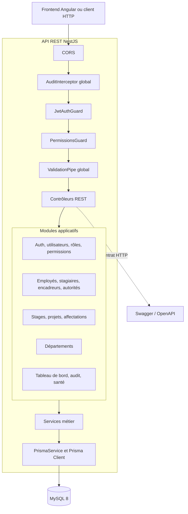
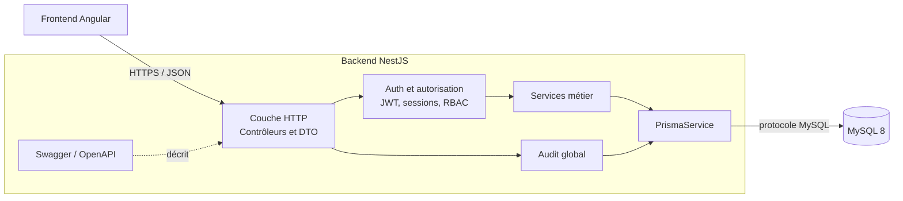
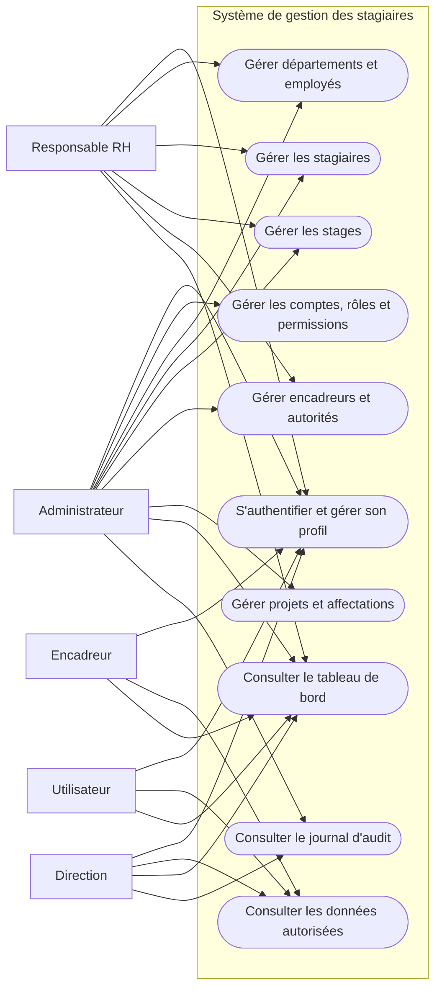
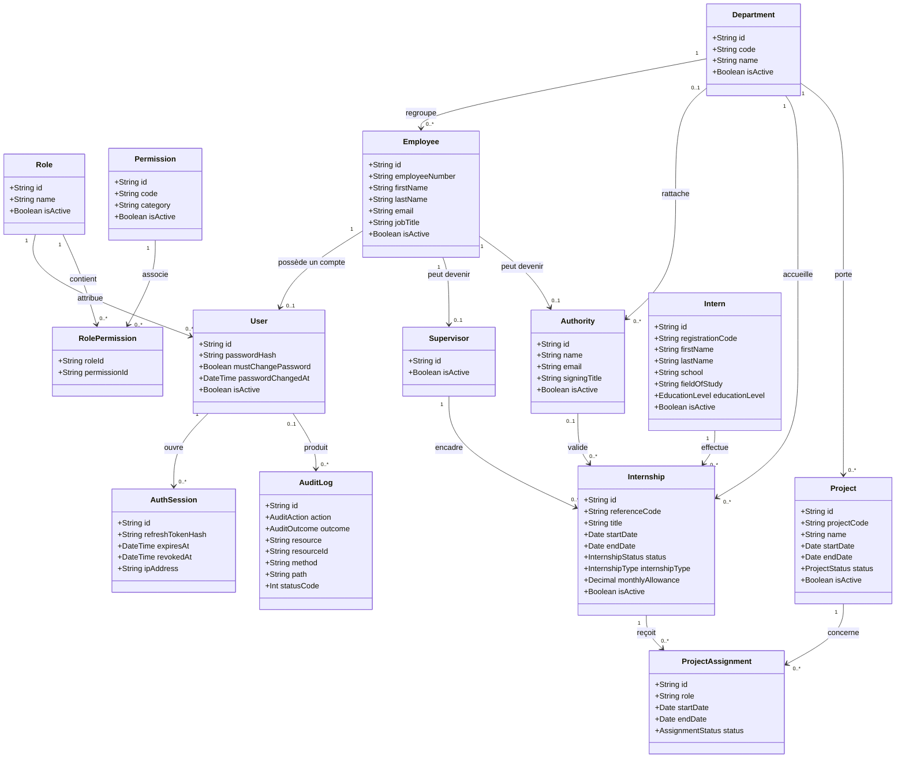
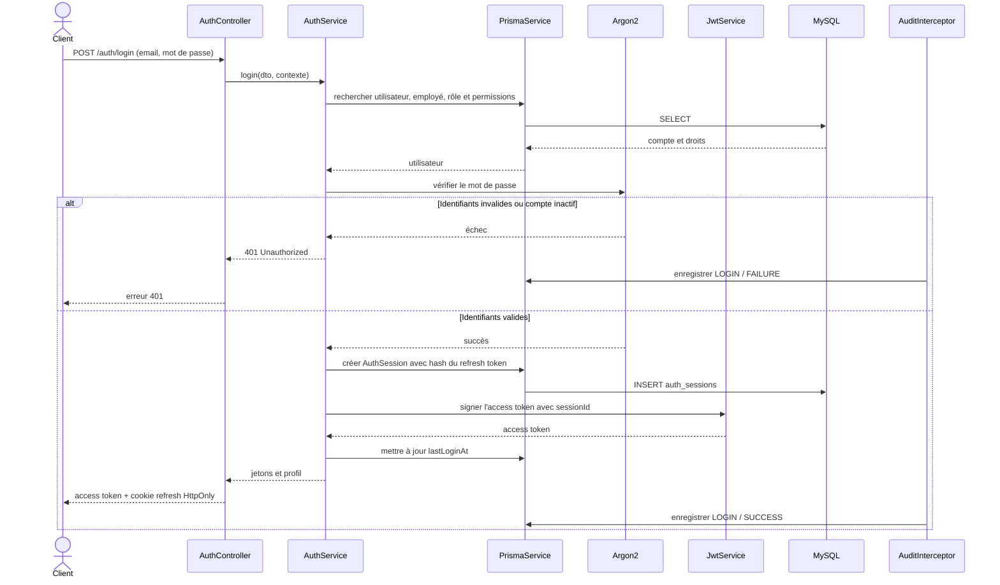
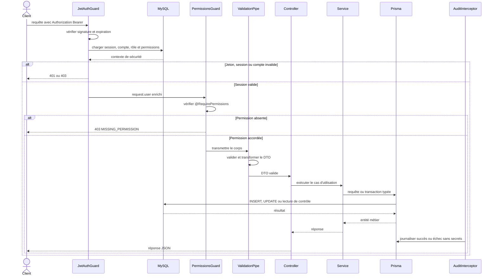

# Architecture backend, technologies et UML

## 1. Périmètre du document

Ce document décrit le backend complet situé dans `gestion_stagiaire_entreprise/`.
Ce choix est fondé sur le code actuellement présent : ce dossier contient
l'authentification, les sessions JWT, les rôles et permissions, l'audit, les
migrations Prisma, les tests et l'ensemble des modules métier.

Un autre backend NestJS plus limité existe à la racine du dépôt. Les deux ne
doivent pas évoluer en parallèle sans décision explicite, car cela créerait deux
sources de vérité. L'architecture de référence retenue ici est donc celle du
sous-dossier `gestion_stagiaire_entreprise/`.

## 2. Synthèse de l'architecture

Le backend est un **monolithe modulaire** construit avec NestJS. Il expose une
API REST JSON, organise chaque domaine métier dans un module autonome et utilise
Prisma pour accéder à une base MySQL.

Le chemin principal d'une requête est le suivant :

```text
Client HTTP
  -> contrôleur NestJS
  -> guards d'authentification et de permissions
  -> validation du DTO
  -> service métier
  -> Prisma Client
  -> MySQL
```

Cette architecture convient au projet parce qu'elle conserve un déploiement
simple tout en séparant clairement les responsabilités. Elle permet aussi
d'extraire un module vers un service indépendant plus tard si la charge ou
l'organisation de l'équipe l'exige.

## 3. Frameworks, bibliothèques et outils utilisés

| Élément                                |               Version déclarée | Utilisation dans le backend                                                                            |
| -------------------------------------- | -----------------------------: | ------------------------------------------------------------------------------------------------------ |
| Node.js                                |  Non verrouillée dans le dépôt | Moteur d'exécution JavaScript côté serveur                                                             |
| TypeScript                             |                       `^5.7.3` | Typage statique et compilation du code                                                                 |
| NestJS                                 |                      `^11.0.1` | Framework principal, injection de dépendances, modules, contrôleurs, services, guards et intercepteurs |
| Express via `@nestjs/platform-express` |                      `^11.0.1` | Adaptateur HTTP utilisé par NestJS                                                                     |
| Prisma Client et CLI                   |                       `^7.9.1` | Modèle de données, migrations, requêtes typées et transactions                                         |
| Adaptateur Prisma MariaDB              |                       `^7.9.1` | Connexion Prisma au serveur MySQL avec le pilote MariaDB                                               |
| MySQL                                  |      `8.0` dans `compose.yaml` | Système de gestion de base de données relationnelle                                                    |
| `mariadb`                              |                       `^3.5.3` | Pilote de connexion utilisé par l'adaptateur Prisma                                                    |
| `@nestjs/jwt`                          |                      `^11.0.2` | Création et vérification des jetons d'accès JWT                                                        |
| Argon2                                 |                      `^0.45.1` | Hachage sécurisé des mots de passe avec Argon2id                                                       |
| `class-validator`                      |                      `^0.15.1` | Validation des données reçues par les DTO                                                              |
| `class-transformer`                    |                       `^0.5.1` | Transformation des valeurs HTTP vers les types attendus                                                |
| Swagger / OpenAPI                      |                      `^11.4.7` | Documentation interactive de l'API sur `/api/docs`                                                     |
| `@nestjs/config` et `dotenv`           |           `^4.0.4` / `^17.4.2` | Chargement centralisé des variables d'environnement                                                    |
| RxJS                                   |                       `^7.8.1` | Chaîne des intercepteurs et traitement asynchrone NestJS                                               |
| Jest, ts-jest et Supertest             | `^30.0.0`, `^29.2.5`, `^7.0.0` | Tests unitaires, d'intégration et end-to-end                                                           |
| ESLint et Prettier                     |           `^9.18.0` / `^3.4.2` | Qualité et formatage du code TypeScript                                                                |
| Docker Compose                         |         fichier `compose.yaml` | Lancement local reproductible de MySQL 8 et volume persistant                                          |

### Pourquoi ces choix

- **NestJS** impose une structure uniforme et facilite le travail en équipe.
- **TypeScript** réduit les erreurs de contrat entre contrôleurs, services et
  accès aux données.
- **Prisma** centralise le schéma relationnel, génère un client typé et rend les
  migrations traçables.
- **MySQL** est adapté aux nombreuses relations et contraintes d'intégrité du
  domaine : stagiaire, stage, département, encadreur, projet et affectation.
- **JWT avec sessions persistées** combine une API sans session mémoire avec la
  possibilité de révoquer les connexions.
- **Argon2id** protège les mots de passe sans conserver de valeur réversible.
- **Swagger** sert de contrat testable entre le backend et les frontends.

## 4. Vue logique de l'architecture



Les routes publiques d'authentification et de santé ne traversent pas forcément
les deux guards. Les contrôleurs métier déclarent explicitement
`JwtAuthGuard`, `PermissionsGuard` et la permission requise.

## 5. Couches et responsabilités

### 5.1 Présentation HTTP

Les contrôleurs reçoivent les requêtes REST, appliquent les guards, déclarent
les permissions et délèguent le traitement au service. Les DTO décrivent et
valident les données entrantes. Le contrôleur ne doit pas porter de logique
métier complexe.

### 5.2 Application et métier

Les services orchestrent les cas d'utilisation : création, consultation,
modification, désactivation, vérification des dates, contrôle des doublons et
validation des relations. Ils lèvent des exceptions HTTP cohérentes en cas de
conflit ou de ressource absente.

### 5.3 Persistance

`PrismaService` instancie le client Prisma avec l'adaptateur MariaDB et les
variables `DATABASE_*`. Le schéma Prisma est la source de vérité du modèle
relationnel. Les suppressions fonctionnelles utilisent principalement
`isActive` ou un statut métier afin de conserver l'historique.

### 5.4 Préoccupations transversales

- `ValidationPipe` supprime les champs inconnus, refuse les propriétés non
  déclarées et transforme les types.
- `JwtAuthGuard` vérifie le JWT, la session, le compte, le rôle et la version du
  mot de passe.
- `PermissionsGuard` compare les permissions exigées avec celles du rôle
  courant.
- `AuditInterceptor` journalise les requêtes d'écriture réussies ou échouées et
  masque les mots de passe, jetons et en-têtes sensibles.
- CORS limite les origines autorisées à `FRONTEND_ORIGINS`.
- Swagger publie le contrat OpenAPI et le schéma Bearer JWT.
- Le module `health` vérifie la disponibilité de la base.

## 6. Modules du backend

| Module                    | Responsabilité principale                                                    |
| ------------------------- | ---------------------------------------------------------------------------- |
| `PrismaModule`            | Connexion et accès partagé à MySQL                                           |
| `HealthModule`            | État de santé de la base de données                                          |
| `AuthModule`              | Connexion, profil, changement de mot de passe, renouvellement et déconnexion |
| `RoleModule`              | Gestion des rôles et attribution des permissions                             |
| `PermissionModule`        | Consultation du catalogue de permissions                                     |
| `UserModule`              | Comptes applicatifs, activation et réinitialisation du mot de passe          |
| `DepartmentModule`        | Structure organisationnelle de l'entreprise                                  |
| `EmployeeModule`          | Employés pouvant devenir utilisateurs, encadreurs ou autorités               |
| `InternModule`            | Identité et parcours scolaire des stagiaires                                 |
| `SupervisorModule`        | Employés habilités à encadrer des stages                                     |
| `AuthorityModule`         | Employés habilités à signer ou valider un stage                              |
| `InternshipModule`        | Cycle de vie des stages et rattachements métier                              |
| `ProjectModule`           | Projets d'un département                                                     |
| `ProjectAssignmentModule` | Affectation d'un stage à un projet sur une période donnée                    |
| `DashboardModule`         | Agrégats et activités récentes                                               |
| `AuditModule`             | Journalisation et consultation des événements sensibles                      |

## 7. Architecture des dossiers

```text
gestion_stagiaire_entreprise/
├── prisma/
│   ├── migrations/             historique de la structure SQL
│   ├── schema.prisma           modèle relationnel de référence
│   └── seed.ts                 rôles, permissions et comptes initiaux
├── src/
│   ├── auth/                   JWT, sessions, guards et permissions
│   ├── audit/                  journalisation transversale
│   ├── config/                 configuration Swagger
│   ├── prisma/                 service d'accès aux données
│   ├── generated/prisma/       client généré par Prisma
│   ├── <domaine>/              module, contrôleur, service, DTO et entité
│   ├── app.module.ts           composition de tous les modules
│   └── main.ts                 démarrage, validation, CORS et Swagger
├── test/                       tests end-to-end
├── docs/                       documentation technique et fonctionnelle
├── compose.yaml                service MySQL local
└── package.json                dépendances et scripts
```

## 8. UML — diagramme de composants



## 9. UML — diagramme de cas d'utilisation

Les rôles initiaux configurés par le seed sont `ADMINISTRATEUR`, `RH`,
`ENCADREUR`, `DIRECTION` et `UTILISATEUR`.



Les capacités exactes ne sont pas codées directement dans le nom du rôle :
elles proviennent des permissions stockées en base. Le diagramme représente les
attributions initiales du seed, qui restent modifiables par l'administrateur.

## 10. UML — diagramme de classes métier

Le diagramme montre les attributs structurants. Les champs techniques
`createdAt`, `updatedAt` et certains champs descriptifs ont été omis pour garder
la lecture claire.



Contraintes importantes du modèle :

- un employé ne possède au maximum qu'un compte utilisateur, un profil
  d'encadreur et un profil d'autorité ;
- une affectation est unique pour le couple `stage + projet` ;
- un stage appartient à un stagiaire, un département et un encadreur ;
- un projet appartient à un département ;
- la suppression d'un rôle ou d'une permission supprime ses associations, mais
  les relations métier sensibles utilisent généralement `Restrict` ;
- les sessions sont supprimées en cascade avec leur utilisateur ;
- les journaux d'audit conservent l'événement même si l'utilisateur disparaît.

## 11. UML — séquence de connexion



## 12. UML — séquence d'une écriture protégée



## 13. UML — diagramme de déploiement

```mermaid
flowchart LR
    subgraph PosteClient[Poste utilisateur]
        Browser[Navigateur<br/>Frontend Angular]
    end

    subgraph ServeurAPI[Serveur applicatif]
        Node[Processus Node.js<br/>API NestJS : port 3000]
        Env[Variables d'environnement]
        Swagger[Swagger : /api/docs]
        Node --- Env
        Node --- Swagger
    end

    subgraph ServeurDB[Serveur de données]
        MySQL[(MySQL 8)]
        Volume[(Volume persistant)]
        MySQL --- Volume
    end

    Browser -->|HTTP(S) JSON + cookie HttpOnly| Node
    Node -->|connexion MySQL configurée| MySQL
```

En développement, `compose.yaml` ne lance actuellement que MySQL. L'API NestJS
est lancée séparément avec `npm run start:dev`.

## 14. Sécurité intégrée à l'architecture

1. Le mot de passe est haché avec Argon2id.
2. L'access token JWT est court et transporte notamment `sub`, `sessionId`, le
   rôle et la version du mot de passe.
3. Le refresh token aléatoire est conservé sous forme de hash SHA-256 dans
   `auth_sessions` et peut être renouvelé ou révoqué.
4. Le refresh token est envoyé par défaut dans un cookie `HttpOnly`, limité au
   chemin `/auth`.
5. Chaque requête protégée recharge l'état de la session, du compte, du rôle et
   des permissions depuis la base.
6. Un changement de mot de passe révoque les sessions existantes.
7. Le RBAC repose sur les permissions, pas uniquement sur le nom du rôle.
8. L'audit masque les valeurs dont la clé contient `password`, `token` ou
   `authorization`.
9. Les DTO refusent les champs non déclarés.

## 15. Règles métier visibles dans les services

- la date de fin doit être postérieure ou égale à la date de début ;
- deux stages actifs non annulés d'un même stagiaire ne doivent pas se
  chevaucher ;
- une affectation doit rester dans les périodes du stage et du projet ;
- un stage, un projet ou une affectation ne peut pas être désactivé dans
  certains états actifs ;
- les codes, références, matricules et emails uniques sont contrôlés ;
- la désactivation est préférée à la suppression physique pour les ressources
  métier.

## 16. Décisions à consolider avant la production

Ces éléments ne remettent pas en cause l'architecture actuelle, mais doivent
être décidés ou ajoutés avant un déploiement de production :

- verrouiller la version de Node.js avec `engines`, `.nvmrc` ou un conteneur ;
- choisir un seul dossier backend de référence et retirer ou archiver le
  doublon présent à la racine ;
- placer l'API derrière HTTPS et activer `AUTH_COOKIE_SECURE=true` ;
- ajouter une limitation de débit sur la connexion et le renouvellement ;
- ajouter les en-têtes de sécurité HTTP et une politique de journalisation ;
- prévoir la sauvegarde, la restauration et la supervision de MySQL ;
- versionner l'API, par exemple avec un préfixe `/api/v1`, si plusieurs clients
  doivent évoluer indépendamment ;
- compléter les tests end-to-end des parcours d'authentification et des cas
  métier critiques ;
- documenter explicitement les transitions autorisées entre les statuts des
  stages, projets et affectations si elles doivent être strictes.

## 17. Références techniques dans le dépôt

- composition de l'application : `src/app.module.ts` ;
- configuration HTTP : `src/main.ts` ;
- schéma relationnel : `prisma/schema.prisma` ;
- authentification : `src/auth/` ;
- audit : `src/audit/` ;
- documentation interactive : `src/config/swagger.config.ts` ;
- contrat frontend : `docs/CONTRAT_FRONTEND.md` ;
- guide fonctionnel : `docs/GUIDE_BACKEND.md` ;
- sessions JWT : `docs/SESSIONS_JWT.md` ;
- rôles et permissions : `docs/ROLES_PERMISSIONS.md`.
