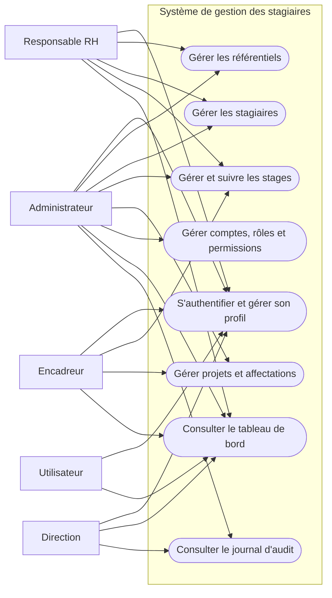
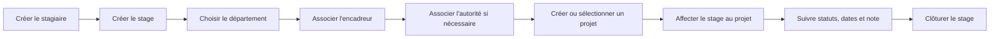
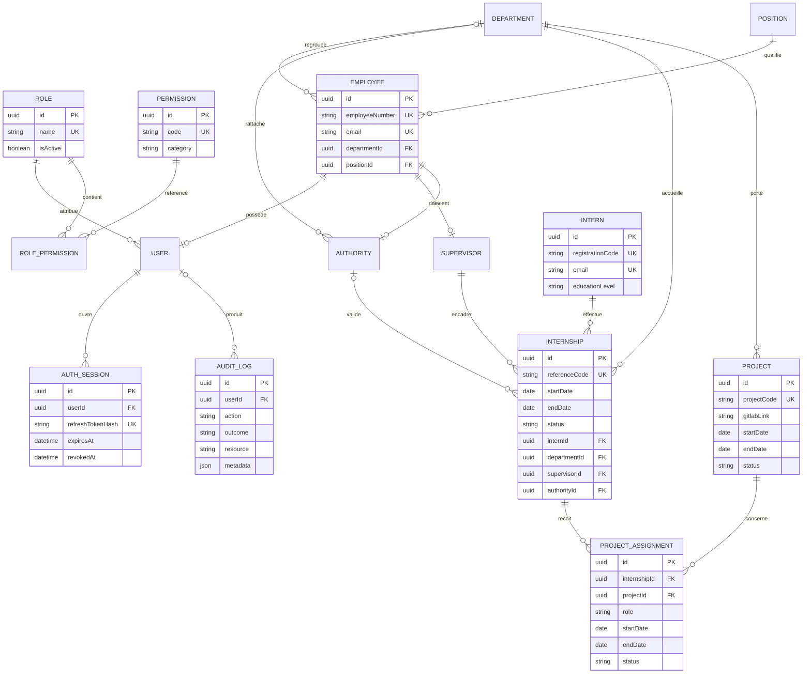
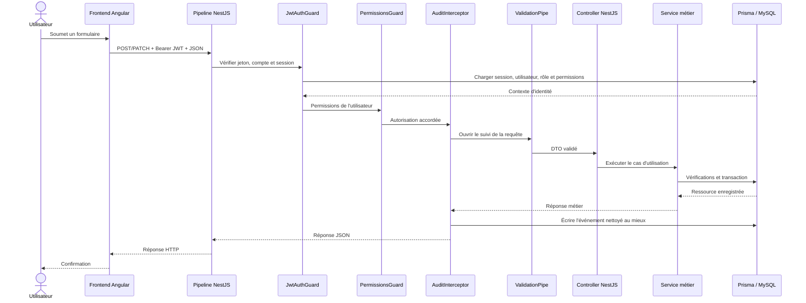
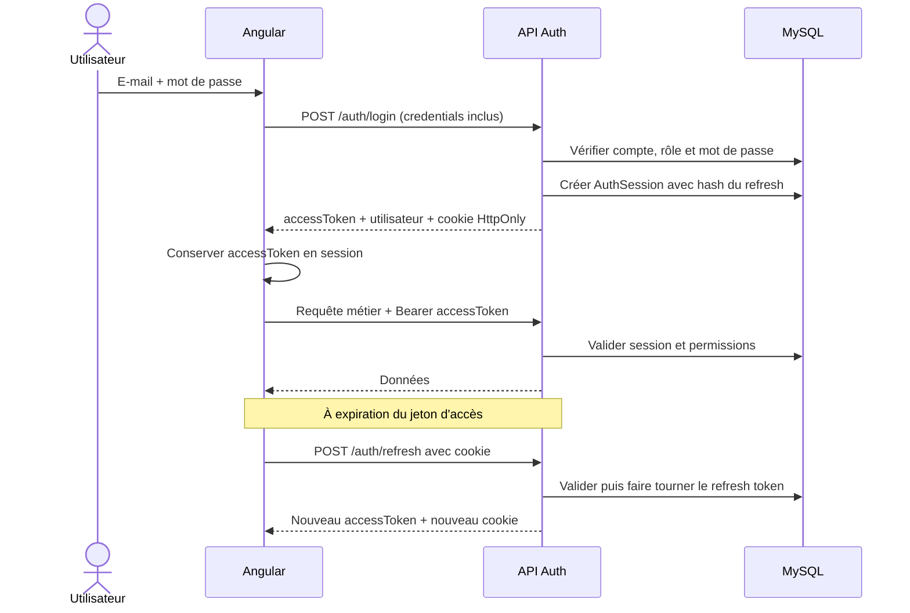
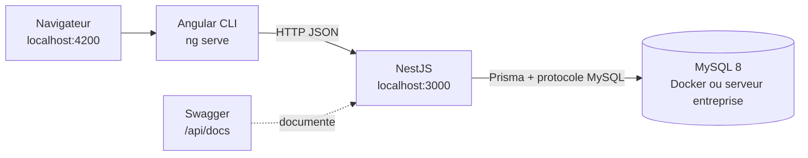
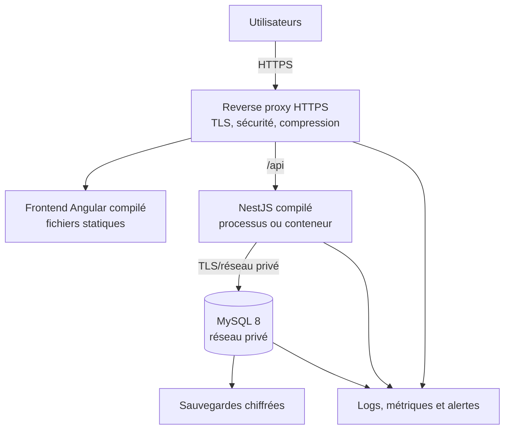

# Conception globale — Application de gestion des stagiaires

> Document d'architecture et de conception destiné au dépôt GitLab
> Version : 1.0 — 24 août 2026
> Statut : architecture de référence, écarts d'intégration identifiés

## 1. Objet du document

Ce document présente la conception globale de l'application de gestion des
stagiaires : vision du produit, acteurs, modules fonctionnels, architecture
frontend et backend, modèle de données, sécurité, flux d'intégration,
déploiement, tests et organisation recommandée dans GitLab.

Il complète la documentation détaillée du backend sans la remplacer :

- [Architecture backend et UML](./gestion_stagiaire_entreprise/docs/ARCHITECTURE_ET_UML.md) ;
- [Contrat d'intégration frontend](./gestion_stagiaire_entreprise/docs/CONTRAT_FRONTEND.md) ;
- [Guide fonctionnel du backend](./gestion_stagiaire_entreprise/docs/GUIDE_BACKEND.md) ;
- [Rôles et permissions](./gestion_stagiaire_entreprise/docs/ROLES_PERMISSIONS.md) ;
- [Sessions JWT](./gestion_stagiaire_entreprise/docs/SESSIONS_JWT.md).

### 1.1 Répartition de la conception

| Intervenant | Responsabilité dans la conception |
| --- | --- |
| Alassane | Architecture globale, diagrammes, consolidation et documentation GitLab |
| Ali | Architecture et validation du backend |
| Moussa | Architecture frontend et intégration avec l'API |
| Djeneba | Base de données, sécurité, configuration et déploiement |
| Maïga | Relecture globale, cohérence fonctionnelle et risques d'intégration |

### 1.2 Sources de vérité retenues

Le dépôt contient plusieurs versions du projet. Pour éviter de décrire un
assemblage qui n'existe pas, la conception retient les sources suivantes :

| Périmètre | Source de vérité | Motif |
| --- | --- | --- |
| Backend | `gestion_stagiaire_entreprise/` | Version complète : authentification, sessions, RBAC, audit, migrations, tests et tous les domaines métier |
| Frontend | `frontend-gestion-stagiaire-entreprise/` | Interface Angular explicitement raccordée au backend entreprise |
| Données | `gestion_stagiaire_entreprise/prisma/schema.prisma` | Schéma relationnel réellement utilisé par Prisma |
| Contrat HTTP | Swagger et `docs/CONTRAT_FRONTEND.md` | Endpoints, DTO, réponses, permissions et erreurs |

Le backend NestJS situé à la racine et les dossiers `frontend-projectO3/` et
`frontend-projectO3-latest/` sont considérés comme des références ou
prototypes. Ils ne doivent pas évoluer comme des applications concurrentes.

## 2. Présentation globale du projet

### 2.1 Contexte

L'application centralise le parcours des stagiaires dans une entreprise. Elle
remplace les suivis dispersés par une source commune pour l'identité du
stagiaire, le stage, l'encadrement, le département d'accueil, les projets, les
affectations, les comptes utilisateurs et la traçabilité des actions.

### 2.2 Objectifs

- enregistrer et maintenir les dossiers des stagiaires ;
- planifier et suivre les stages de leur création à leur clôture ;
- rattacher chaque stage à un département, un encadreur et, si nécessaire, une
  autorité signataire ;
- affecter un stage à un ou plusieurs projets sur des périodes cohérentes ;
- fournir un tableau de bord de pilotage ;
- contrôler les accès par rôles et permissions ;
- conserver une trace des opérations sensibles ;
- exposer un contrat REST exploitable par l'interface web et d'autres clients.

### 2.3 Valeur métier

La plateforme apporte une vision fiable des stages en cours et à venir,
réduit les doubles saisies, sécurise les responsabilités et facilite les
contrôles RH et de direction. Le lien GitLab d'un projet peut être associé au
suivi pour rapprocher l'activité du stagiaire du travail technique réalisé.

### 2.4 Périmètre actuel

Le périmètre couvre la gestion interne des stagiaires et des ressources
administratives. Il ne comprend pas encore un portail public de candidature,
la signature électronique, la gestion documentaire, les notifications par
e-mail/SMS, la paie des indemnités ni une application mobile dédiée.

## 3. Acteurs et contrôle d'accès

Les droits effectifs sont portés par des permissions dynamiques liées aux
rôles. Les rôles initiaux du seed sont les suivants.

| Acteur | Responsabilités principales prévues |
| --- | --- |
| Administrateur | Paramétrage complet, comptes, rôles, permissions, données métier, audit |
| Responsable RH | Gestion des employés, stagiaires, encadreurs, autorités et stages ; consultation du reste |
| Encadreur | Consultation des données nécessaires au suivi des stages et projets |
| Direction | Consultation globale, employés et journal d'audit |
| Utilisateur | Consultation standard autorisée par son rôle |

La sécurité de l'API ne doit jamais dépendre uniquement des menus ou des gardes
Angular. Le backend vérifie le JWT, la session et la permission exigée pour
chaque route protégée.

### 3.1 UML — cas d'utilisation synthétiques



Ce diagramme résume l'expérience actuellement exposée par Angular. Le seed
backend accorde toutefois plusieurs permissions de lecture à `UTILISATEUR`,
alors que le guard frontend le redirige vers le tableau de bord. Cette
divergence doit être tranchée puis alignée dans les deux couches.

## 4. Modules fonctionnels

### 4.1 Modules principaux

| Module | Description | API principale | Données clés |
| --- | --- | --- | --- |
| Tableau de bord | Indicateurs, stages actifs/planifiés et activités récentes | `/dashboard` | Agrégats de stages, stagiaires, projets et audit |
| Stagiaires | Identité, contacts et parcours académique | `/interns` | Matricule, identité, école, filière, niveau |
| Stages | Période, type, statut, département, encadrement et note | `/internships` | Référence, dates, statut, indemnité, relations |
| Suivi des stages | Vue transversale et filtrable du cycle des stages/projets | `/internships/tracking` | Synthèse stagiaire, stage, encadreur et affectations |
| Projets | Projets internes auxquels les stages peuvent contribuer | `/projects` | Code, nom, dates, statut, département, lien GitLab |
| Affectations | Participation d'un stage à un projet | `/project-assignments` | Mission, période, statut, notes |

### 4.2 Référentiels organisationnels

| Module | Description | API principale |
| --- | --- | --- |
| Départements | Unités d'accueil et de responsabilité | `/departments` |
| Postes | Référentiel des fonctions des employés | `/positions` |
| Employés | Personnel de l'entreprise | `/employees` |
| Encadreurs | Employés habilités à encadrer | `/supervisors` |
| Autorités | Employés habilités à valider ou signer | `/authorities` |

### 4.3 Administration et sécurité

| Module | Description | API principale |
| --- | --- | --- |
| Authentification | Connexion, profil, renouvellement, déconnexion, mot de passe | `/auth` |
| Utilisateurs | Comptes applicatifs liés aux employés | `/users` |
| Rôles | Regroupement de droits | `/roles` |
| Permissions | Catalogue des actions autorisées | `/permissions` |
| Audit | Historique des écritures et opérations sensibles | `/audit-logs` |
| Santé | Vérification de la disponibilité de MySQL | `/health/database` |

### 4.4 Parcours métier principal



## 5. Principes d'architecture

L'application suit une architecture web en trois niveaux : interface,
application/API et données. Le backend est un **monolithe modulaire** : un seul
service est déployé, mais chaque domaine est isolé dans un module NestJS.

Principes retenus :

- séparation claire entre présentation, métier et persistance ;
- API REST JSON comme contrat entre Angular et NestJS ;
- validation des entrées à la frontière de l'API ;
- autorisation par permission côté serveur ;
- modèle relationnel centralisé dans Prisma ;
- désactivation fonctionnelle plutôt que suppression physique lorsque
  l'historique doit être conservé ;
- documentation exécutable via OpenAPI/Swagger ;
- tests automatisés par module ;
- configuration sensible par variables d'environnement.

## 6. Architecture globale

```mermaid
flowchart TB
    U[Utilisateur métier]

    subgraph Client[Frontend Angular 22]
        Router[Router et lazy loading]
        Pages[Pages fonctionnelles]
        Guards[Guards d'accès]
        Interceptors[Intercepteurs HTTP]
        Http[Services HTTP et état d'authentification]
    end

    subgraph API[Backend NestJS 11]
        Cors[CORS]
        Jwt[JwtAuthGuard]
        Rbac[PermissionsGuard]
        Audit[AuditInterceptor global]
        Validation[ValidationPipe et DTO]
        Controllers[Contrôleurs REST]
        Services[Services métier]
        Prisma[PrismaService / Prisma Client]
        Docs[Swagger / OpenAPI]
    end

    DB[(MySQL 8)]

    U --> Router
    Router --> Pages
    Pages --> Guards
    Pages --> Interceptors
    Interceptors --> Http
    Http -->|HTTP(S) + JSON| Cors
    Cors --> Jwt
    Jwt --> Rbac
    Rbac --> Audit
    Audit --> Validation
    Validation --> Controllers
    Controllers --> Services
    Services --> Prisma
    Prisma -->|SQL| DB
    Docs -. décrit .-> Controllers
```

### 6.1 Chemin d'une requête métier

```text
Page Angular
  -> service HTTP
  -> intercepteur d'authentification
  -> CORS / pipeline NestJS
  -> garde JWT
  -> garde de permissions
  -> AuditInterceptor (avant traitement)
  -> ValidationPipe + DTO
  -> contrôleur NestJS
  -> service métier
  -> Prisma Client
  -> MySQL
  -> réponse JSON
```

Les routes publiques, notamment la connexion et la santé de la base, ne
traversent pas nécessairement tous les gardes.

Dans le cycle NestJS, les guards s'exécutent avant les intercepteurs et les
pipes. L'intercepteur d'audit entoure ensuite le traitement du contrôleur. Un
refus produit directement par un guard n'est donc pas capturé par
`AuditInterceptor`.

## 7. Architecture frontend

### 7.1 Technologies

| Technologie | Version déclarée | Rôle |
| --- | ---: | --- |
| Angular | `22.1.2` | Framework de l'interface web |
| TypeScript | `~6.0.2` | Typage et compilation |
| Angular Router | `22.1.2` | Navigation, guards et chargement différé |
| Angular Forms | `22.1.2` | Formulaires de connexion et formulaires métier |
| Angular HttpClient | `22.1.2` | Communication avec l'API REST |
| RxJS | `~7.8.0` | Flux HTTP et traitements asynchrones |
| Vitest / jsdom | `4.0.8` / `28.0.0` | Tests de composants et services |
| Angular CLI | `22.1.4` | Build, développement et tests |

Le frontend utilise des composants autonomes et le chargement différé des
pages. Il ne dépend pas d'une bibliothèque UI externe déclarée dans
`package.json`.

### 7.2 Organisation des dossiers

```text
frontend-gestion-stagiaire-entreprise/
├── src/app/
│   ├── core/
│   │   ├── auth/              état et parcours d'authentification
│   │   ├── guards/            auth, invité, administrateur, permission
│   │   ├── interceptors/      ajout du JWT et traitement des erreurs
│   │   ├── layout/            shell, navigation et structure principale
│   │   ├── models/            contrats d'authentification et d'erreur
│   │   └── services/          client API et notifications
│   ├── features/
│   │   ├── auth/              connexion et changement de mot de passe
│   │   ├── dashboard/         vue agrégée
│   │   ├── resources/         listes, détails et formulaires génériques
│   │   ├── tracking/          suivi des stages et projets
│   │   ├── account/           profil courant
│   │   └── not-found/         erreurs de navigation et accès refusé
│   ├── shared/                composants visuels réutilisables
│   ├── app.routes.ts          routes et chargement différé
│   └── app.config.ts          routeur, client HTTP et intercepteurs
└── src/environments/          URL de l'API
```

### 7.3 Composants structurants

- `AuthService` conserve le JWT d'accès et l'utilisateur dans
  `sessionStorage`, calcule l'état connecté et expose les permissions ;
- `authInterceptor` ajoute `Authorization: Bearer <token>` uniquement aux
  appels vers l'API configurée ;
- `errorInterceptor` normalise les erreurs de connexion, de session et de
  changement obligatoire du mot de passe ;
- `authGuard`, `guestGuard`, `adminGuard` et `resourceAccessGuard` contrôlent la
  navigation ;
- `ResourceDataService` centralise les opérations CRUD ;
- `RESOURCE_CONFIGS` décrit les colonnes, champs, relations et endpoints des
  écrans génériques ;
- `AppShell` compose le menu selon le rôle et les permissions.

### 7.4 Routes fonctionnelles principales

| Route Angular | Page / ressource |
| --- | --- |
| `/connexion` | Connexion |
| `/changer-mot-de-passe` | Changement obligatoire ou volontaire |
| `/tableau-de-bord` | Tableau de bord |
| `/stagiaires` | Stagiaires |
| `/stages` | Stages |
| `/suivi-stages` | Suivi transversal |
| `/departements` | Départements |
| `/encadreurs` | Encadreurs |
| `/autorites` | Autorités |
| `/projets` | Projets |
| `/affectations` | Affectations de projets |
| `/employes` | Employés |
| `/utilisateurs` | Utilisateurs |
| `/roles` | Rôles |
| `/permissions` | Permissions |
| `/journal-audit` | Journal d'audit |
| `/profil` | Profil de l'utilisateur courant |

Les pages de ressources sont générées à partir d'une configuration commune.
Cette approche réduit la duplication, mais toute particularité métier doit
rester explicite pour éviter des formulaires trop génériques.

## 8. Architecture backend

### 8.1 Technologies

| Technologie | Version déclarée | Rôle |
| --- | ---: | --- |
| Node.js | Non verrouillée | Exécution serveur |
| TypeScript | `^5.7.3` | Typage du backend |
| NestJS | `^11.0.1` | Modules, injection, contrôleurs, services et gardes |
| Express | `^11.0.1` via NestJS | Adaptateur HTTP |
| Prisma | `^7.9.1` | Schéma, migrations, client typé et transactions |
| Adaptateur MariaDB / pilote `mariadb` | `^7.9.1` / `^3.5.3` | Connexion de Prisma à MySQL |
| MySQL | `8.0` | Base relationnelle |
| JWT NestJS | `^11.0.2` | Jetons d'accès |
| Argon2 | `^0.45.1` | Hachage Argon2id des mots de passe |
| class-validator / class-transformer | `^0.15.1` / `^0.5.1` | Validation et transformation des DTO |
| Swagger / OpenAPI | `^11.4.7` | Contrat interactif de l'API |
| Jest / Supertest | `^30.0.0` / `^7.0.0` | Tests unitaires et end-to-end |
| ESLint / Prettier | `^9.18.0` / `^3.4.2` | Qualité et formatage |

### 8.2 Organisation interne

Chaque domaine suit principalement la structure :

```text
src/<domaine>/
├── <domaine>.module.ts       assemblage NestJS
├── <domaine>.controller.ts   routes, gardes et permissions
├── <domaine>.service.ts      logique métier et accès Prisma
├── dto/                      validation des entrées
├── entities/                 représentation de sortie/documentation
└── *.spec.ts                 tests automatisés
```

### 8.3 Modules NestJS

| Module | Responsabilité |
| --- | --- |
| `PrismaModule` | Connexion partagée à MySQL |
| `HealthModule` | Santé de la base |
| `AuthModule` | Connexion, sessions, profil, mot de passe, refresh et logout |
| `RoleModule` | Rôles et affectation des permissions |
| `PermissionModule` | Catalogue des permissions |
| `UserModule` | Comptes, activation et réinitialisation du mot de passe |
| `DepartmentModule` | Départements |
| `PositionModule` | Postes des employés |
| `EmployeeModule` | Employés |
| `InternModule` | Stagiaires |
| `SupervisorModule` | Encadreurs |
| `AuthorityModule` | Autorités signataires |
| `InternshipModule` | Stages et suivi |
| `ProjectModule` | Projets |
| `ProjectAssignmentModule` | Affectations stage-projet |
| `DashboardModule` | Statistiques et activités récentes |
| `AuditModule` | Écriture et consultation du journal d'audit |

### 8.4 Couches et responsabilités

| Couche | Composants | Responsabilité |
| --- | --- | --- |
| Présentation HTTP | Controllers, DTO, Swagger | Recevoir, documenter et valider les requêtes |
| Sécurité | Guards, décorateurs de permissions | Authentifier et autoriser |
| Application / métier | Services | Orchestrer les cas d'utilisation et règles métier |
| Persistance | PrismaService et client généré | Transactions et accès à MySQL |
| Transversal | Audit, CORS, configuration, erreurs | Appliquer les politiques communes |

### 8.5 Règles métier déjà implémentées

- une date de fin doit être postérieure ou égale à la date de début ;
- la date de naissance d'un stagiaire ne peut pas être future ;
- deux stages actifs et non annulés d'un même stagiaire ne doivent pas se
  chevaucher ;
- la période d'une affectation doit être contenue dans celles du stage et du
  projet ;
- un même stage ne peut être affecté deux fois au même projet ;
- un stage en cours, un projet actif dans certains statuts ou une affectation
  active ne peut pas toujours être désactivé immédiatement ;
- les relations utilisées doivent exister et être actives ;
- les références de stage, codes projet, matricules et e-mails sont uniques ;
- les codes projet sont générés automatiquement et de manière transactionnelle
  au format `PRJ-AAAA-NNNN`, puis restent immuables ;
- les textes et e-mails sont normalisés avant enregistrement ;
- les ressources historiques sont généralement désactivées au lieu d'être
  supprimées physiquement ;
- un changement de mot de passe révoque les sessions actives de l'utilisateur.
- un employé ne peut posséder qu'un seul compte utilisateur ;
- un compte ne peut pas se désactiver lui-même et le dernier administrateur est
  protégé ;
- un rôle utilisé ne peut pas être désactivé et les permissions critiques du
  rôle administrateur sont protégées.

## 9. Architecture des données

### 9.1 Principes

- identifiants UUID stockés en `CHAR(36)` ;
- clés étrangères et contraintes d'unicité définies dans Prisma/MySQL ;
- relations critiques en suppression restrictive ;
- tables de jointure pour les relations plusieurs-à-plusieurs ;
- horodatage de création et de mise à jour ;
- champ `isActive` ou statut pour préserver l'historique ;
- migrations versionnées dans `prisma/migrations/` ;
- données initiales de rôles, permissions et comptes dans `prisma/seed.ts`.

### 9.2 UML — modèle relationnel simplifié



### 9.3 Entités et relations essentielles

- un employé appartient à un département et possède un poste ;
- un compte utilisateur est rattaché à un seul employé et à un seul rôle ;
- un employé peut devenir encadreur ou autorité signataire ;
- un stagiaire peut effectuer plusieurs stages dans le temps ;
- un stage possède un département et un encadreur, et peut avoir une autorité ;
- un projet appartient à un département ;
- `ProjectAssignment` relie un stage et un projet avec sa propre période et sa
  mission ;
- `RolePermission` relie les rôles au catalogue de permissions ;
- `AuthSession` permet la rotation et la révocation des connexions ;
- `AuditLog` conserve l'auteur, l'action, le résultat et les métadonnées
  nettoyées.

## 10. API et intégration frontend-backend

### 10.1 Convention REST

| Opération | Méthode | Convention |
| --- | --- | --- |
| Liste | `GET` | `/<resource>` |
| Détail | `GET` | `/<resource>/:id` |
| Création | `POST` | `/<resource>` |
| Modification | `PATCH` | `/<resource>/:id` |
| Désactivation | `DELETE` | `/<resource>/:id` |

Les permissions suivent la forme `resource.action`, par exemple
`internships.read`, `projects.update` ou `audit-logs.read`.

Swagger expose :

- l'interface interactive : `http://localhost:3000/api/docs` ;
- le contrat OpenAPI JSON : `http://localhost:3000/api/docs-json`.

### 10.2 Séquence d'une écriture protégée



### 10.3 Contrats d'erreur

Le frontend doit traiter au minimum :

- `400` : données ou règle métier invalides ;
- `401` : identifiants incorrects ou session invalide ;
- `403` : permission absente ou changement de mot de passe obligatoire ;
- `404` : ressource introuvable ;
- `409` : doublon, chevauchement ou opération incompatible avec l'état ;
- `500` : erreur interne, sans exposition d'informations sensibles.

## 11. Authentification, session et autorisation

### 11.1 Mécanisme backend

1. la connexion vérifie l'e-mail et le mot de passe Argon2id ;
2. le backend crée une ligne `AuthSession` ;
3. il émet un JWT d'accès court contenant notamment l'identifiant de session ;
4. il place le refresh token dans un cookie `HttpOnly` limité au chemin `/auth` ;
5. le hash SHA-256 du refresh token de session est conservé dans
   `AuthSession` ; un ancien champ `User.refreshTokenHash` subsiste dans le
   schéma et doit être migré ou supprimé après vérification ;
6. le renouvellement fait tourner le refresh token ;
7. la déconnexion ou le changement de mot de passe révoque la session ;
8. chaque requête protégée recharge le compte, le rôle, la session et les
   permissions avant d'autoriser l'action.

### 11.2 Séquence de connexion et renouvellement cible



### 11.3 Changement obligatoire du mot de passe

Lorsqu'un compte possède `mustChangePassword=true`, le frontend redirige vers
`/changer-mot-de-passe` et le backend refuse les autres opérations. Après le
changement, les sessions sont révoquées et une nouvelle connexion est exigée.

## 12. Sécurité

### 12.1 Mesures présentes

| Mesure | Implémentation actuelle |
| --- | --- |
| Mots de passe | Argon2id, aucune valeur réversible |
| Jetons | JWT d'accès court + refresh aléatoire avec hash en base |
| Révocation | Session persistée, logout et changement de mot de passe |
| Autorisation | RBAC dynamique et permissions par route |
| Validation | Liste blanche des DTO, champs inconnus refusés, conversion des types |
| CORS | Origines configurables et envoi d'identifiants autorisé |
| Audit | Écritures entrées dans l'intercepteur : succès/échecs, auteur, ressource, IP, user-agent et durée |
| Masquage | Mots de passe, jetons et autorisation retirés des métadonnées d'audit |
| Documentation | Schéma Bearer dans Swagger |
| Secrets | Fichier `.env` local, exemple sans secret valide |

L'audit est **best-effort et non transactionnel** : `recordSafely()` n'annule
pas l'opération métier si l'écriture du journal échoue. De plus, un rejet émis
par un guard intervient avant l'intercepteur et n'est pas enregistré par ce
mécanisme. La production doit au minimum surveiller ces échecs et décider si un
retry/outbox ou une transaction est requis pour les actions critiques.

### 12.2 Mesures à ajouter avant production

- HTTPS obligatoire via reverse proxy ;
- `AUTH_COOKIE_SECURE=true` et stratégie `SameSite` validée selon les domaines ;
- protection CSRF si le cookie doit être envoyé en contexte intersite ;
- limitation de débit sur login et refresh ;
- en-têtes HTTP de sécurité, par exemple avec Helmet ;
- rotation et stockage centralisé des secrets ;
- politique de sauvegarde/restauration MySQL testée ;
- centralisation des logs, métriques, alertes et corrélation des requêtes ;
- analyse des dépendances et du code dans la CI ;
- politique de conservation et d'accès au journal d'audit ;
- tests d'autorisation négatifs pour chaque famille de permissions.
- validation centralisée et typée des variables d'environnement au démarrage ;
- `issuer` et `audience` explicites pour les JWT ;
- restriction de Swagger et des informations retournées par la route de santé
  en production ;
- nettoyage planifié des sessions expirées ou révoquées.

## 13. Architecture de déploiement

### 13.1 Développement actuel



Le `compose.yaml` actuel démarre uniquement MySQL. Aucun `Dockerfile` ni
pipeline GitLab CI n'est encore présent dans le dépôt.

### 13.2 Cible de production recommandée



### 13.3 Variables d'environnement principales

| Variable | Usage |
| --- | --- |
| `DATABASE_HOST`, `DATABASE_PORT` | Adresse MySQL |
| `DATABASE_USER`, `DATABASE_PASSWORD`, `DATABASE_NAME` | Identifiants et base |
| `JWT_SECRET` | Signature des JWT |
| `JWT_EXPIRES_IN_SECOND` | Durée du jeton d'accès |
| `JWT_REFRESH_EXPIRES_IN_SECOND` | Durée maximale de la session renouvelable |
| `FRONTEND_ORIGINS` | Origines CORS autorisées |
| `PORT` | Port HTTP de l'API |
| `AUTH_REFRESH_COOKIE_NAME` | Nom du cookie de refresh |
| `AUTH_COOKIE_SECURE`, `AUTH_COOKIE_SAME_SITE` | Politique du cookie |
| `AUTH_EXPOSE_REFRESH_TOKEN` | Exposition exceptionnelle du refresh token, à désactiver en production |

Les valeurs de production ne doivent jamais être versionnées dans GitLab.

## 14. Tests et qualité

### 14.1 Backend

Le backend contient des tests de services, DTO, contrôleurs, gardes,
authentification, audit, tableau de bord et règles de dates/relations. Les
services Prisma sont simulés dans les tests unitaires afin de ne pas modifier la
base de l'entreprise.

Vérification effectuée sur la version analysée : **27 suites et 150 tests
unitaires réussis**, puis **1 suite et 2 tests end-to-end réussis**. Les tests
end-to-end actuels restent légers : ils ne couvrent pas une base MySQL réelle
ni les parcours HTTP complets d'authentification et de CRUD.

Commandes de référence :

```powershell
npx prisma validate
npm run build
npm test -- --runInBand
npm run test:e2e -- --runInBand
```

### 14.2 Frontend

Le frontend contient des tests Vitest pour les services d'authentification,
le shell et certaines pages. Les contrôles de référence sont :

```powershell
npm run build
npm test -- --watch=false
```

### 14.3 Stratégie de tests cible

| Niveau | Cible |
| --- | --- |
| Unitaire | Règles métier, DTO, services, guards, composants et présentateurs |
| Intégration | Services NestJS avec base MySQL de test isolée |
| Contrat | Vérification du client Angular contre l'OpenAPI généré |
| End-to-end | Connexion, changement de mot de passe, CRUD autorisé/interdit, suivi complet |
| Sécurité | Permissions négatives, session révoquée, refresh rejoué, entrées invalides |
| Non-régression | Chevauchement des stages, périodes des affectations et désactivations |

## 15. Exigences non fonctionnelles

| Exigence | Décision ou cible mesurable |
| --- | --- |
| Sécurité | Moindre privilège, HTTPS, secrets hors Git et audit des écritures |
| Disponibilité | Santé MySQL exposée, supervision et procédure de reprise |
| Performance | Pagination serveur des listes volumineuses et index sur clés de recherche |
| Maintenabilité | Modules par domaine, conventions communes et contrat OpenAPI |
| Traçabilité | Audit des écritures et historique GitLab des changements |
| Qualité | Build, lint et tests obligatoires avant fusion |
| Compatibilité | Versions Node/npm verrouillées et navigateurs cibles documentés |
| Évolutivité | Monolithe modulaire extractible si un domaine exige un service séparé |
| Accessibilité | Navigation clavier, contrastes, libellés et messages d'erreur vérifiés |
| Protection des données | Collecte minimale, accès par rôle et durée de conservation définie |

## 16. Écarts constatés entre l'architecture et l'intégration actuelle

Ces écarts sont des éléments de backlog, pas des fonctionnalités à considérer
comme terminées.

| Priorité | Écart constaté | Impact | Correction attendue |
| --- | --- | --- | --- |
| Haute | Angular ne fait pas encore appel à `/auth/refresh` et le logout ne révoque que la session locale | Expiration brutale du JWT et session serveur non fermée depuis l'interface | Ajouter `withCredentials`, refresh à requête unique, rejeu contrôlé et `POST /auth/logout` |
| Haute | Les routes d'écriture Angular utilisent `adminGuard` pour toutes les ressources et `/employes` est entièrement `adminOnly` | RH ne peut ni lire les employés ni utiliser ses droits backend de gestion des stagiaires, stages, encadreurs et autorités | Remplacer le contrôle par les permissions exactes `*.read/create/update/deactivate` |
| Haute | `UTILISATEUR` reçoit des permissions de lecture côté backend mais `resourceAccessGuard` le limite au tableau de bord | Politique incohérente entre client et serveur | Décider la règle métier puis aligner seed, menus et guards |
| Haute | Le backend utilise `positionId`, tandis que le formulaire employés Angular utilise encore `jobTitle` | Création/modification d'employé potentiellement incompatible | Ajouter le module Postes dans l'interface et envoyer `positionId` |
| Moyenne | Le module `/positions` n'a pas de route ni de configuration Angular | Référentiel des postes non administrable depuis l'interface | Ajouter liste, détail, formulaire et permission `positions.*` |
| Moyenne | Le backend permet `PUT /roles/:id/permissions`, mais aucune interface dédiée n'est finalisée | L'administrateur ne peut pas gérer finement les droits dans Angular | Ajouter une matrice rôle-permission |
| Moyenne | Le backend permet `PATCH /users/:id/reset-password`, mais l'action n'est pas exposée dans Angular | Réinitialisation impossible depuis l'interface | Ajouter une action dédiée, confirmation et contrôle de permission |
| Moyenne | Les listes métier utilisent surtout une recherche locale et sont peu paginées | Temps de chargement croissant avec le volume | Ajouter filtres et pagination serveur avec contrat commun |
| Moyenne | Plusieurs backends et frontends coexistent dans le même dépôt | Dérive, builds ambigus et maintenance double | Archiver les prototypes et déclarer un seul chemin de build |
| Moyenne | Aucune CI GitLab, aucun Dockerfile et aucune version Node verrouillée | Builds non reproductibles | Ajouter pipeline, images de build et fichier de version runtime |
| Moyenne | Le frontend n'a qu'un environnement local sans substitution de production | URL `localhost` susceptible d'être livrée par erreur | Injecter l'URL d'API par environnement |
| Moyenne | `User.refreshTokenHash` subsiste alors que l'authentification utilise `AuthSession.refreshTokenHash` | Deux représentations possibles d'un même concept | Migrer puis supprimer le champ legacy |
| Moyenne | Les variables exigées par le seed ne sont pas toutes décrites dans `.env.example` | Initialisation non reproductible | Documenter les e-mails et mots de passe du seed |
| Moyenne | Swagger et la santé sont publics ; la santé expose un agrégat métier | Informations inutilement visibles | Restreindre l'accès et limiter la réponse aux indicateurs techniques |
| Basse | Le service de notifications n'a pas de composant global clairement raccordé | Retours utilisateur potentiellement invisibles | Raccorder les notifications au shell |
| Basse | Le document backend historique ne mentionne pas encore `PositionModule` partout | Documentation partiellement obsolète | Mettre à jour les documents spécialisés à partir de cette conception |

## 17. Organisation recommandée dans GitLab

### 17.1 Structure documentaire immédiate

Le présent fichier peut être placé à la racine du dépôt et lié depuis le
`README.md`. Une évolution propre serait :

```text
docs/
└── conception/
    ├── README.md                 vue globale et index
    ├── architecture.md           composants, couches et déploiement
    ├── modules-fonctionnels.md   acteurs, règles et parcours
    ├── donnees.md                modèle relationnel et dictionnaire
    ├── securite.md               authentification, RBAC et audit
    └── integration-api.md        OpenAPI, erreurs et flux frontend
```

### 17.2 Structure applicative cible

Après validation de l'équipe, les sources de vérité pourraient être regroupées
sans conserver les doublons :

```text
gestion-stagiaires/
├── apps/
│   ├── frontend/                Angular
│   └── backend/                 NestJS + Prisma
├── docs/conception/             documentation GitLab
├── infrastructure/             compose, proxy et déploiement
├── .gitlab-ci.yml
├── README.md
└── CODEOWNERS
```

Cette réorganisation est une cible et ne doit pas être faite sans merge
request dédiée, sauvegarde et validation des chemins de build.

### 17.3 Méthode de contribution

- protéger la branche `main` ;
- créer une branche `feature/<ticket>-<description>` ou
  `fix/<ticket>-<description>` ;
- associer chaque changement à une issue GitLab ;
- utiliser une merge request avec revue du responsable du domaine ;
- exiger une CI verte et une documentation à jour ;
- éviter de versionner `.env`, secrets, dumps et dépendances générées ;
- utiliser les migrations Prisma pour toute évolution du schéma ;
- joindre une preuve de test et, pour l'interface, une capture du parcours.

### 17.4 Responsabilités de revue proposées

| Type de changement | Relecteur principal | Relecteurs associés |
| --- | --- | --- |
| Backend / API | Ali | Djeneba pour données et sécurité, Alassane pour architecture |
| Frontend / intégration | Moussa | Ali pour contrat API |
| Base / migration / sécurité | Djeneba | Ali et Alassane |
| Architecture / documentation | Alassane | Ali, Moussa, Djeneba et Maïga |
| Validation fonctionnelle globale | Maïga | Responsable métier concerné |

## 18. Pipeline GitLab CI/CD recommandé

```mermaid
flowchart LR
    Commit[Commit / Merge request]
    Install[Installation verrouillée]
    Quality[Lint + format check]
    Unit[Tests unitaires]
    Build[Build frontend + backend]
    Contract[Validation Prisma + contrat API]
    Security[Audit dépendances + scan secrets]
    Package[Images ou artefacts versionnés]
    Staging[Déploiement staging]
    E2E[Tests end-to-end]
    Prod[Déploiement production approuvé]

    Commit --> Install --> Quality --> Unit --> Build --> Contract --> Security
    Security --> Package --> Staging --> E2E --> Prod
```



Étapes minimales d'une merge request :

1. installation reproductible avec `npm ci` ;
2. validation et génération Prisma ;
3. lint et tests backend ;
4. build backend ;
5. tests et build frontend ;
6. analyse de secrets et dépendances ;
7. publication des rapports de tests et artefacts ;
8. déploiement seulement depuis une branche protégée.

La base utilisée dans la CI doit être une instance MySQL jetable dédiée aux
tests, jamais la base de l'entreprise.

## 19. Décisions d'architecture à valider

| Décision | Recommandation |
| --- | --- |
| Backend de référence | Confirmer `gestion_stagiaire_entreprise/`, puis archiver le backend racine |
| Frontend de référence | Confirmer `frontend-gestion-stagiaire-entreprise/`, puis archiver les variantes ProjectO3 |
| Gestion des droits frontend | Utiliser les permissions dynamiques, pas seulement le nom du rôle |
| Préfixe de l'API | Préparer `/api/v1` avec migration du frontend, du reverse proxy, du chemin du cookie, des règles d'audit et de Swagger |
| Déploiement | Choisir processus supervisé ou conteneurs et documenter la reprise |
| Données d'entreprise | Définir sauvegarde, rétention, restauration et accès administrateur |
| Statuts métier | Formaliser les transitions autorisées des stages, projets et affectations |
| Audit | Définir conservation, export, accès et protection contre l'altération |
| Pagination | Standardiser `{ items, page, pageSize, total }` |
| Documentation | Générer/contrôler le contrat frontend depuis OpenAPI |
| Disponibilité de l'audit | Décider si le mode best-effort est acceptable ou si certaines actions doivent échouer sans audit |
| Santé et Swagger | Décider de leur authentification ou désactivation en production |

## 20. Feuille de route proposée

### Lot 1 — Alignement du dépôt

- confirmer les deux sources de vérité ;
- archiver les variantes ;
- verrouiller Node et npm ;
- placer cette conception dans GitLab et la lier au README.

### Lot 2 — Finalisation de l'intégration

- raccorder refresh et logout ;
- aligner les gardes Angular sur les permissions backend ;
- intégrer les postes et `positionId` ;
- terminer la matrice rôle-permission ;
- corriger les contrats de formulaires et réponses.

### Lot 3 — Industrialisation

- ajouter GitLab CI ;
- créer les images ou scripts de déploiement ;
- ajouter une base de test isolée et les E2E critiques ;
- mettre en place HTTPS, rate limiting, en-têtes de sécurité et supervision.

### Lot 4 — Évolutions métier

- pagination et filtres serveur ;
- notifications ;
- documents et conventions de stage ;
- exports de pilotage ;
- portail stagiaire si validé par le métier.

## 21. Critères de fin d'un module

Un module est considéré terminé lorsque :

- ses règles métier et ses permissions sont validées ;
- son modèle Prisma et sa migration sont revus ;
- ses endpoints sont documentés dans OpenAPI ;
- l'interface utilise le contrat réel de l'API ;
- les cas autorisés et interdits sont testés ;
- les erreurs sont compréhensibles sans exposer de données sensibles ;
- l'audit est produit pour les écritures ;
- le build frontend et backend passe dans la CI ;
- la documentation GitLab est mise à jour.

## 22. Références techniques du dépôt

- composition backend : `gestion_stagiaire_entreprise/src/app.module.ts` ;
- démarrage HTTP, validation et CORS :
  `gestion_stagiaire_entreprise/src/main.ts` ;
- schéma de données : `gestion_stagiaire_entreprise/prisma/schema.prisma` ;
- données initiales : `gestion_stagiaire_entreprise/prisma/seed.ts` ;
- authentification : `gestion_stagiaire_entreprise/src/auth/` ;
- audit : `gestion_stagiaire_entreprise/src/audit/` ;
- routes Angular :
  `frontend-gestion-stagiaire-entreprise/src/app/app.routes.ts` ;
- authentification Angular :
  `frontend-gestion-stagiaire-entreprise/src/app/core/auth/auth.service.ts` ;
- configuration des ressources Angular :
  `frontend-gestion-stagiaire-entreprise/src/app/features/resources/resource-config.ts` ;
- URL de l'API :
  `frontend-gestion-stagiaire-entreprise/src/environments/environment.ts`.

---

Ce document décrit l'état constaté du code et la cible recommandée. Toute
décision qui modifie les sources de vérité, le modèle de données, les droits ou
le déploiement doit être validée par l'équipe dans une issue et une merge
request GitLab.
