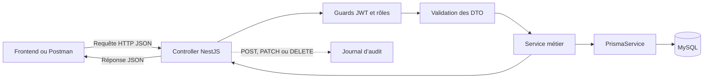
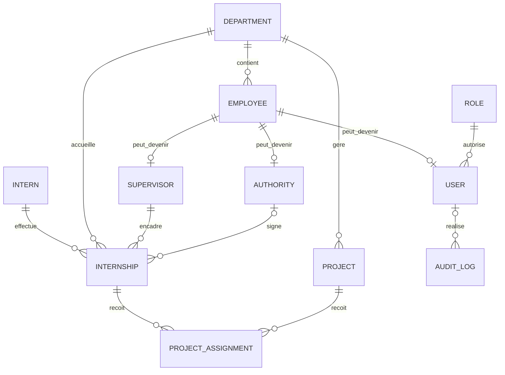

# Guide fonctionnel et technique du backend

Ce document explique le backend de gestion des stagiaires tel qu’il est actuellement implémenté. Il présente son architecture, ses domaines, leurs routes, leurs relations et les termes qui peuvent facilement être confondus.

## 1. Objectif général

Le backend permet à l’entreprise de gérer :

- les membres de son personnel ;
- les comptes autorisés à utiliser l’application ;
- les stagiaires et leurs informations académiques ;
- les stages effectués dans l’entreprise ;
- les encadreurs et les autorités signataires ;
- les projets et l’affectation des stages à ces projets ;
- les statistiques du tableau de bord ;
- la traçabilité des actions avec le journal d’audit.

Il s’agit d’une API REST construite avec NestJS. Prisma communique avec la base MySQL de l’entreprise.

## 2. Architecture d’une requête



Le rôle de chaque couche est le suivant :

- **Controller** : reçoit la requête, définit la route et appelle le service.
- **Guard** : vérifie le JWT et, si nécessaire, le rôle de l’utilisateur.
- **DTO** : définit les données acceptées et applique les validations.
- **Service** : contient les règles métier et les accès à la base.
- **PrismaService** : exécute les requêtes sur MySQL.
- **Module** : assemble le controller et le service d’un domaine.
- **Test `.spec.ts`** : vérifie le comportement du domaine sans modifier la base de l’entreprise.

La validation globale rejette les champs inconnus, transforme les valeurs compatibles et vérifie toutes les contraintes des DTO.

## 3. Relations principales entre les domaines



Les relations les plus importantes sont :

1. un employé appartient à un département ;
2. un employé peut avoir au maximum un compte utilisateur ;
3. un employé peut aussi avoir un profil d’encadreur et/ou d’autorité ;
4. un stagiaire peut effectuer plusieurs stages à des périodes différentes ;
5. un stage concerne un stagiaire, un département et un encadreur ;
6. une autorité signataire peut être ajoutée au stage ;
7. un stage peut être affecté à un ou plusieurs projets au moyen des affectations.

## 4. Authentification, autorisation et droits

### 4.1 Authentification

L’authentification répond à la question : **qui utilise l’application ?**

Après `POST /auth/login`, le backend crée une session MySQL et retourne un JWT d’accès valable 15 minutes. Les routes protégées doivent recevoir :

```text
Authorization: Bearer VOTRE_JWT
```

Le JWT contient notamment :

- `sub` : identifiant du compte utilisateur ;
- `sessionId` : identifiant de la session active dans MySQL ;
- `employeeId` : identifiant de l’employé correspondant ;
- `email` : email professionnel de l’employé ;
- `role` : rôle applicatif de l’utilisateur ;
- `iat` et `exp` : dates techniques de création et d’expiration du JWT.

Le mot de passe est haché avec Argon2id. Le hash n’est jamais retourné par l’API. Un refresh token valable 7 jours permet de renouveler silencieusement le JWT. Seul son hash SHA-256 est conservé dans `auth_sessions`. La révocation de cette session invalide immédiatement les JWT qui lui sont liés. Le fonctionnement complet est détaillé dans [Sessions JWT](SESSIONS_JWT.md).

### 4.2 Autorisation

L’autorisation répond à la question : **qu’a-t-il le droit de faire ?**

Les rôles et permissions sont dynamiques et enregistrés dans MySQL. Les rôles initiaux sont `ADMINISTRATEUR`, `RH`, `ENCADREUR`, `DIRECTION` et `UTILISATEUR`.

Chaque route exige un code précis tel que `projects.read` ou `users.create`. Le rôle `ADMINISTRATEUR` reçoit tous les droits actifs. Le détail complet est disponible dans [Rôles et permissions](ROLES_PERMISSIONS.md).

Les routes `/auth/me` et `/auth/change-password` concernent le compte connecté. La route de santé de la base reste publique dans l’implémentation actuelle.

## 5. Tableau général des routes

| Domaine          | Route principale       | Consultation                          | Modification                                             |
| ---------------- | ---------------------- | ------------------------------------- | -------------------------------------------------------- |
| Authentification | `/auth`                | Profil et renouvellement de session   | Connexion, déconnexion et changement de son mot de passe |
| Rôles            | `/roles`               | Permission `roles.read`               | Permissions de gestion du rôle                           |
| Permissions      | `/permissions`         | Permission `permissions.read`         | Catalogue géré par les migrations                        |
| Départements     | `/departments`         | Permission `departments.read`         | Permissions `create`, `update`, `deactivate`             |
| Postes           | `/positions`           | Permission `positions.read`           | Permissions `create`, `update`, `deactivate`             |
| Employés         | `/employees`           | Permission `employees.read`           | Permissions `create`, `update`, `deactivate`             |
| Utilisateurs     | `/users`               | Permission `users.read`               | Permissions de gestion des comptes                       |
| Encadreurs       | `/supervisors`         | Permission `supervisors.read`         | Permissions `create`, `update`, `deactivate`             |
| Autorités        | `/authorities`         | Permission `authorities.read`         | Permissions `create`, `update`, `deactivate`             |
| Stagiaires       | `/interns`             | Permission `interns.read`             | Permissions `create`, `update`, `deactivate`             |
| Stages           | `/internships`         | Permission `internships.read`         | Permissions `create`, `update`, `deactivate`             |
| Projets          | `/projects`            | Permission `projects.read`            | Permissions `create`, `update`, `deactivate`             |
| Affectations     | `/project-assignments` | Permission `project-assignments.read` | Permissions `create`, `update`, `deactivate`             |
| Tableau de bord  | `/dashboard`           | Permission `dashboard.read`           | Aucune route de modification                             |
| Journal d’audit  | `/audit-logs`          | Permission `audit-logs.read`          | Aucune route de modification                             |
| Santé de la base | `/health/database`     | Publique                              | Aucune route de modification                             |

Pour les domaines CRUD, les routes suivent généralement cette convention :

| Méthode  | Route            | Action exigée          |
| -------- | ---------------- | ---------------------- |
| `POST`   | `/ressource`     | Créer                  |
| `GET`    | `/ressource`     | Lister                 |
| `GET`    | `/ressource/:id` | Consulter un élément   |
| `PATCH`  | `/ressource/:id` | Modifier partiellement |
| `DELETE` | `/ressource/:id` | Désactiver ou retirer  |

Dans ce projet, un `DELETE` est généralement une **suppression logique**. L’enregistrement reste dans la base pour conserver l’historique.

## 6. Explication de chaque domaine

### 6.1 Authentification — `/auth`

**Rôle du domaine**

Identifier l’utilisateur, créer une session révocable, renouveler son JWT et lui permettre de consulter son profil ou de changer son mot de passe.

**Routes**

- `POST /auth/login` : vérifie l’email et le mot de passe, crée la session, retourne le JWT et les informations du compte ;
- `POST /auth/refresh` : fait tourner le refresh token et retourne un nouveau JWT ;
- `POST /auth/logout` : révoque la session et supprime le cookie de refresh ;
- `GET /auth/me` : retourne le profil du compte connecté ;
- `PATCH /auth/change-password` : change le mot de passe du compte connecté et révoque toutes ses sessions.

**Règles importantes**

- la connexion utilise l’email de la fiche **Employee**, car le modèle `User` ne possède pas son propre champ email ;
- le compte, l’employé et le rôle doivent tous être actifs ;
- le nouveau mot de passe doit être différent de l’ancien ;
- un refresh token est utilisable une seule fois avant rotation ;
- une déconnexion, un changement de mot de passe, une réinitialisation ou une désactivation révoque les sessions concernées ;
- les connexions et changements de mot de passe sont inscrits dans le journal d’audit.

### 6.2 Rôles — `/roles`

**Rôle du domaine**

Définir les droits applicatifs attribuables aux comptes utilisateurs.

**Données principales**

- nom, description et état du rôle ;
- liste des permissions actives attribuées.

**Actions**

- créer, lister, consulter, modifier et désactiver un rôle ;
- remplacer ses permissions avec `PUT /roles/:id/permissions` ;
- consulter le catalogue avec `GET /permissions` ;
- attribuer n’importe quel rôle actif à un compte.

Le rôle `ADMINISTRATEUR` est protégé et conserve toutes les permissions actives.

### 6.3 Départements — `/departments`

**Rôle du domaine**

Représenter les unités organisationnelles de l’entreprise : informatique, ressources humaines, finance, etc.

**Données principales**

- nom unique ;
- code unique ;
- description ;
- état actif/inactif.

**Relations**

Un département peut être lié à des employés, autorités, stages et projets.

**Actions et règles**

- lecture par tout utilisateur connecté ;
- création, modification et désactivation par un administrateur ;
- le nom et le code ne peuvent pas être dupliqués ;
- un département inactif ne peut pas être utilisé pour créer un nouvel employé, stage ou projet.

### 6.3.1 Postes — `/positions`

**Rôle du domaine**

Maintenir un catalogue unique des fonctions professionnelles attribuables aux employés. Le poste décrit le métier dans l’entreprise et ne doit pas être confondu avec le rôle applicatif.

**Données principales**

- code unique, normalisé en majuscules ;
- nom unique ;
- description facultative ;
- état actif/inactif ;
- nombre d’employés actifs qui utilisent le poste.

**Actions et règles**

- `GET /positions` et `GET /positions/:id` consultent le catalogue ;
- `POST /positions` ajoute un poste ;
- `PATCH /positions/:id` modifie ou réactive un poste ;
- `DELETE /positions/:id` effectue une désactivation logique ;
- un poste utilisé par un employé actif ne peut pas être désactivé ;
- seuls les postes actifs peuvent être choisis lors de la création ou modification d’un employé ;
- l’administrateur possède les droits de gestion, tandis que les autres rôles initiaux possèdent uniquement `positions.read`.

La migration initialise les postes Développeur backend, Développeur frontend, Administrateur système, Responsable RH, Chef de projet, Responsable réseau et Assistant administratif. Les anciens intitulés présents dans `employees.job_title` sont importés automatiquement avant la suppression de cette ancienne colonne.

### 6.4 Employés — `/employees`

**Rôle du domaine**

Conserver la fiche professionnelle d’un membre du personnel de l’entreprise.

**Données principales**

- matricule professionnel unique ;
- prénom et nom ;
- email professionnel unique ;
- téléphone ;
- poste actif sélectionné dans le catalogue (`positionId`) ;
- département ;
- état actif/inactif.

**Actions et règles**

- toutes les routes sont réservées aux administrateurs ;
- le département choisi doit être actif ;
- le poste choisi doit être actif ;
- le matricule et l’email sont uniques ;
- la liste générale retourne les employés actifs ;
- la suppression désactive l’employé sans effacer son historique.

**Pourquoi ce domaine est central**

La fiche Employee est la source de l’identité professionnelle. Les domaines User, Supervisor et Authority ajoutent des capacités différentes à cette même personne.

### 6.5 Utilisateurs — `/users`

**Rôle du domaine**

Donner à un employé le droit de se connecter à l’application.

**Données principales**

- `employeeId` : employé propriétaire du compte ;
- `roleId` : rôle applicatif ;
- hash du mot de passe ;
- obligation éventuelle de changer le mot de passe ;
- date du dernier changement et de la dernière connexion ;
- état actif/inactif.

**Routes particulières**

- `PATCH /users/:id/reset-password` : réinitialisation administrative du mot de passe ;
- `DELETE /users/:id` : désactivation du compte.

**Règles de sécurité**

- un compte ne peut être créé que pour un employé actif ;
- un employé ne peut posséder qu’un seul compte ;
- le mot de passe de création ou de réinitialisation contient entre 15 et 128 caractères ;
- un administrateur ne peut pas désactiver son propre compte ;
- le dernier administrateur actif ne peut pas être désactivé ou rétrogradé ;
- les réponses ne contiennent jamais le hash du mot de passe.

### 6.6 Encadreurs ou maîtres de stage — `/supervisors`

**Rôle du domaine**

Déclarer qu’un employé peut encadrer un stage.

Le terme technique anglais `Supervisor` correspond ici à **encadreur** ou **maître de stage**.

**Données principales**

Le profil contient essentiellement :

- l’identifiant de l’employé ;
- son état actif/inactif.

Le nom, l’email, le poste et le département proviennent de la fiche Employee liée.

**Actions et règles**

- l’employé doit exister et être actif ;
- un employé ne peut posséder qu’un seul profil Supervisor ;
- un encadreur ne peut pas être désactivé tant qu’il possède un stage planifié ou en cours ;
- tout utilisateur connecté peut consulter les encadreurs ;
- seul un administrateur peut les créer, modifier ou désactiver.

### 6.7 Autorités signataires — `/authorities`

**Rôle du domaine**

Identifier la personne responsable de la validation ou de la signature administrative d’un stage.

**Données principales**

- employé correspondant ;
- département facultatif ;
- nom utilisé pour la signature ;
- email de l’autorité ;
- titre de signature (`signingTitle`) ;
- état actif/inactif.

**Actions et règles**

- l’employé et le département éventuellement indiqué doivent être actifs ;
- un employé ne peut posséder qu’un seul profil Authority ;
- l’email d’autorité est unique ;
- l’autorité ne peut pas être désactivée si elle est liée à un stage planifié ou en cours.

**Point d’attention**

Contrairement au profil Supervisor, Authority possède ses propres champs `name` et `email`. Ils ne sont pas automatiquement synchronisés si la fiche Employee change. Le frontend et l’administration doivent donc conserver ces informations cohérentes.

### 6.8 Stagiaires — `/interns`

**Rôle du domaine**

Conserver l’identité personnelle et le parcours académique de la personne accueillie en stage.

**Données principales**

- code d’inscription unique ;
- identité, date de naissance et genre ;
- email et téléphone ;
- adresse ;
- établissement, filière, niveau et année d’étude ;
- contact d’urgence ;
- état actif/inactif.

**Valeurs actuellement prévues**

- genre : `MALE` ou `FEMALE` ;
- niveau : `LICENCE` ou `MASTER` ;
- année d’étude : de 1 à 10.

**Actions et règles**

- le code d’inscription et l’email sont uniques ;
- la date de naissance doit être valide et ne pas être future ;
- la suppression désactive le stagiaire ;
- tout utilisateur connecté peut consulter ; seul l’administrateur peut modifier.

Un stagiaire n’est pas automatiquement un utilisateur de l’application et ne possède actuellement aucun compte de connexion.

### 6.9 Stages — `/internships`

**Rôle du domaine**

Représenter une période réelle de stage effectuée par un stagiaire dans l’entreprise.

**Données principales**

- référence unique ;
- titre et description ;
- dates de début et de fin ;
- type de stage ;
- statut ;
- indemnité mensuelle et devise ;
- lieu de travail ;
- note facultative de 0 à 20 ;
- stagiaire, département, encadreur et autorité facultative.

**Types**

- `ACADEMIC` : stage académique ;
- `PROFESSIONAL` : stage professionnel.

**Statuts**

- `PLANNED` : planifié ;
- `ONGOING` : en cours ;
- `COMPLETED` : terminé ;
- `CANCELLED` : annulé.

**Règles importantes**

- toutes les relations doivent pointer vers des éléments actifs ;
- la date de fin ne peut pas précéder la date de début ;
- un même stagiaire ne peut pas avoir deux stages actifs non annulés qui se chevauchent ;
- la note, lorsqu’elle existe, est un entier compris entre 0 et 20 ;
- un stage en cours doit être terminé ou annulé avant sa désactivation.

### 6.10 Projets — `/projects`

**Rôle du domaine**

Représenter un projet de l’entreprise auquel un stage peut contribuer.

**Données principales**

- code projet unique ;
- nom et description ;
- lien GitLab facultatif et valide ;
- dates de début et de fin ;
- statut ;
- département responsable ;
- état actif/inactif.

**Statuts**

- `PLANNED` : planifié ;
- `ONGOING` : en cours ;
- `COMPLETED` : terminé ;
- `CANCELLED` : annulé ;
- `ON_HOLD` : suspendu.

**Règles importantes**

- le département doit être actif ;
- la période doit être cohérente ;
- un projet en cours ne peut pas être désactivé ;
- un projet possédant encore une affectation active ne peut pas être désactivé.

### 6.11 Affectations de projets — `/project-assignments`

**Rôle du domaine**

Créer le lien entre un stage et un projet. L’affectation indique le rôle du stagiaire sur le projet et la période de sa participation.

**Données principales**

- `internshipId` : stage concerné ;
- `projectId` : projet concerné ;
- rôle ou mission sur le projet ;
- dates de participation ;
- statut ;
- notes facultatives.

**Statuts**

- `ASSIGNED` : affecté ;
- `IN_PROGRESS` : participation en cours ;
- `COMPLETED` : participation terminée ;
- `REMOVED` : affectation retirée.

**Règles importantes**

- le stage et le projet doivent être actifs et planifiés ou en cours ;
- la période d’affectation doit être incluse à la fois dans la période du stage et dans celle du projet ;
- une même combinaison stage/projet ne peut être créée qu’une seule fois ;
- `DELETE` ne supprime pas la ligne : il passe le statut à `REMOVED` ;
- les affectations retirées ne figurent plus dans la liste générale.

### 6.12 Tableau de bord — `/dashboard`

**Rôle du domaine**

Fournir au frontend une seule réponse regroupant les indicateurs utiles à la page d’accueil.

La réponse contient notamment :

- le nombre de stagiaires actifs ;
- les stagiaires ajoutés pendant le mois courant ;
- le nombre de stages et leur répartition par statut ;
- le nombre de projets et leur répartition par statut ;
- les encadreurs et départements actifs ;
- les derniers stagiaires enregistrés ;
- le suivi synthétique des cinq stages actifs les plus récents avec stagiaire, département, encadreur et projet ;
- les activités récentes provenant du journal d’audit.

Cette route exige la permission `dashboard.read` et ne modifie aucune donnée.

### 6.13 Journal d’audit — `/audit-logs`

**Rôle du domaine**

Conserver une trace persistante des actions importantes effectuées dans l’API.

Le journal enregistre automatiquement les requêtes `POST`, `PUT`, `PATCH` et `DELETE`, notamment :

- création ;
- modification, y compris l’attribution des permissions ;
- désactivation ou retrait ;
- connexion et déconnexion ;
- changement de mot de passe ;
- réinitialisation administrative de mot de passe.

Chaque événement peut contenir :

- l’utilisateur ayant réalisé l’action ;
- l’action et son résultat `SUCCESS` ou `FAILURE` ;
- la ressource et son identifiant ;
- la méthode et la route HTTP ;
- le code de réponse ;
- l’adresse IP et le navigateur/client ;
- des métadonnées nettoyées ;
- la date de l’événement.

Les mots de passe, JWT et valeurs d’autorisation sont remplacés par `[REDACTED]` avant enregistrement.

**Routes**

- `GET /audit-logs` : liste paginée avec filtres ;
- `GET /audit-logs/:id` : détail d’un événement.

Les filtres disponibles sont la page, la limite, l’action, le résultat, la ressource, l’utilisateur et la période. La consultation exige la permission `audit-logs.read`. Aucune route ne permet de modifier ou supprimer un événement d’audit.

### 6.14 Santé de la base — `/health/database`

**Rôle du domaine**

Vérifier rapidement que l’API peut communiquer avec MySQL.

La route exécute une requête simple de comptage des rôles et retourne :

- `status: "ok"` ;
- le type de base `mysql` ;
- le nombre de rôles ;
- la date du contrôle.

Cette route est publique dans l’implémentation actuelle.

### 6.15 Prisma et configuration — sans route métier

**Prisma** constitue la couche d’accès aux données :

- `prisma/schema.prisma` décrit les modèles, relations, contraintes et énumérations ;
- `prisma/migrations/` contient les évolutions SQL à appliquer à MySQL ;
- `src/prisma/prisma.service.ts` ouvre la connexion avec les variables du fichier `.env` ;
- `src/generated/prisma/` est généré par `npx prisma generate` et ne doit pas être modifié manuellement.

La configuration Swagger expose :

- `/api/docs` : interface de test et documentation ;
- `/api/docs-json` : contrat OpenAPI au format JSON.

## 7. Différences entre les termes faciles à confondre

### 7.1 Employé, utilisateur, encadreur et autorité

| Terme                  | Ce qu’il représente                              | Peut se connecter ? | Fonction dans les stages           |
| ---------------------- | ------------------------------------------------ | ------------------- | ---------------------------------- |
| Employé                | Fiche professionnelle d’un membre du personnel   | Non, pas à lui seul | Base d’identité des autres profils |
| Utilisateur            | Compte applicatif lié à un employé               | Oui                 | Dépend de son rôle applicatif      |
| Encadreur / Supervisor | Profil d’un employé chargé du suivi du stage     | Pas nécessairement  | Encadre le stagiaire               |
| Autorité / Authority   | Profil d’un employé habilité à valider ou signer | Pas nécessairement  | Valide ou signe administrativement |

Une même personne peut donc être :

- Employee seulement ;
- Employee + User ;
- Employee + Supervisor ;
- Employee + Authority ;
- ou cumuler plusieurs de ces profils.

Exemple : Moussa peut être employé du département informatique, avoir un compte utilisateur simple et être également maître de stage.

### 7.2 Poste professionnel et rôle applicatif

- `Employee.position` décrit le **métier dans l’entreprise**, par exemple « Responsable RH » ou « Développeur backend ».
- `User.role` regroupe les **droits dans l’application**. Les rôles initiaux sont `ADMINISTRATEUR`, `RH`, `ENCADREUR`, `DIRECTION` et `UTILISATEUR`.

Un responsable RH n’est donc pas automatiquement administrateur de l’application.

### 7.3 Stagiaire et stage

- **Intern** est la personne : identité, école, filière, contacts.
- **Internship** est une période de stage : dates, département, encadreur, statut et note.

La même personne peut revenir effectuer un autre stage plus tard. Elle conserve une seule fiche Intern et reçoit une nouvelle fiche Internship.

### 7.4 Stage, projet et affectation

- **Internship** décrit l’accueil du stagiaire dans l’entreprise.
- **Project** décrit un travail ou produit de l’entreprise.
- **ProjectAssignment** indique que le stage participe à un projet précis pendant une période précise.

Créer un stage ne l’affecte donc pas automatiquement à un projet.

### 7.5 Encadreur et autorité

- l’**encadreur** suit le travail quotidien et technique du stagiaire ;
- l’**autorité** intervient dans la validation ou la signature administrative.

Le stage exige un encadreur, tandis que l’autorité est facultative dans le modèle actuel.

### 7.6 Département de l’employé et département du stage

- `Employee.departmentId` indique l’unité d’appartenance du salarié ;
- `Internship.departmentId` indique l’unité qui accueille le stage ;
- `Project.departmentId` indique l’unité responsable du projet ;
- `Authority.departmentId` est facultatif.

Le backend ne force pas actuellement l’encadreur à appartenir au même département que le stage.

### 7.7 Statut métier et `isActive`

Ces deux notions ne sont pas équivalentes :

- le **statut** décrit l’avancement métier : planifié, en cours, terminé, etc. ;
- `isActive` indique si la fiche reste utilisable dans les opérations courantes.

Par exemple, un stage peut être `COMPLETED` tout en restant actif et consultable. Le désactiver permet de l’archiver sans supprimer son historique.

### 7.8 Les différents identifiants

- `employeeId` attend l’identifiant de la table Employee ;
- `userId` attend l’identifiant du compte User ;
- `supervisorId` attend l’identifiant du profil Supervisor, et non celui de l’employé ;
- `authorityId` attend l’identifiant du profil Authority ;
- `internId` attend l’identifiant du stagiaire ;
- `internshipId` attend l’identifiant du stage ;
- `projectId` attend l’identifiant du projet.

Cette distinction est indispensable lors de la construction des formulaires du frontend.

## 8. Ordre conseillé pour créer les données

Pour éviter les erreurs de relations, l’ordre recommandé est :

1. déployer la migration des rôles et permissions ;
2. créer les départements ;
3. créer les employés ;
4. créer les comptes utilisateurs nécessaires ;
5. transformer certains employés en encadreurs ;
6. déclarer les autorités signataires ;
7. créer les stagiaires ;
8. créer les stages ;
9. créer les projets ;
10. affecter les stages aux projets.

## 9. Structure des dossiers du backend

```text
src/
├── auth/                 authentification JWT et changement de mot de passe
├── role/                 rôles applicatifs
├── permission/           catalogue des permissions
├── department/           départements
├── employee/             personnel de l’entreprise
├── user/                 comptes de connexion
├── supervisor/           encadreurs ou maîtres de stage
├── authority/            autorités signataires
├── intern/               fiches des stagiaires
├── internship/           périodes de stage
├── project/              projets
├── project-assignment/   liens entre stages et projets
├── dashboard/            statistiques et activités récentes
├── audit/                journalisation et consultation des audits
├── health/               contrôle de la base
├── prisma/               service de connexion Prisma
├── generated/prisma/     client généré automatiquement
├── config/               configuration Swagger
├── app.module.ts         assemblage général des modules
└── main.ts               démarrage, validation, CORS et Swagger

prisma/
├── schema.prisma         modèle de données MySQL
└── migrations/           scripts SQL versionnés

test/
└── app.e2e-spec.ts       tests de l’application complète et de Swagger
```

Dans un domaine classique :

```text
nom-du-domaine/
├── dto/
│   ├── create-....dto.ts   données acceptées à la création
│   └── update-....dto.ts   données acceptées à la modification
├── ....controller.ts       routes HTTP
├── ....service.ts          règles métier et accès Prisma
├── ....module.ts           assemblage NestJS
└── ....service.spec.ts     tests unitaires
```

Le fichier `src/user/entities/user.entity.ts` est actuellement un squelette vide créé par NestJS. La définition réelle de la table User se trouve dans `prisma/schema.prisma` et les objets exposés sont contrôlés par le service et les DTO.

## 10. Codes d’erreur courants

| Code               | Signification dans ce backend                               |
| ------------------ | ----------------------------------------------------------- |
| `400 Bad Request`  | Données invalides, champ inconnu ou dates incohérentes      |
| `401 Unauthorized` | JWT absent/invalide ou identifiants de connexion incorrects |
| `403 Forbidden`    | Utilisateur authentifié mais rôle insuffisant               |
| `404 Not Found`    | Ressource ou relation demandée introuvable/inactive         |
| `409 Conflict`     | Doublon ou règle métier empêchant l’opération               |

## 11. Points d’entrée utiles pendant le développement

- API locale : `http://localhost:3000`
- Swagger : `http://localhost:3000/api/docs`
- OpenAPI JSON : `http://localhost:3000/api/docs-json`
- Test MySQL : `GET http://localhost:3000/health/database`
- Profil connecté : `GET http://localhost:3000/auth/me`
- Tableau de bord : `GET http://localhost:3000/dashboard`

Commandes de vérification :

```powershell
npx prisma validate
npx prisma generate
npm run build
npm test -- --runInBand
npm run test:e2e -- --runInBand
```

Les migrations de la base de l’entreprise doivent être appliquées explicitement avec :

```powershell
npx prisma migrate deploy
```
